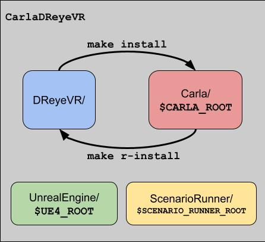

# `DReyeVR` Development

For users who want a deeper dive into the inner workings of DReyeVR and how they can get started with development and writing code, look no further!

(This guide assumes you've read the [`Usage.md`](../Usage.md) documentation and have `DReyeVR` installed)

# Getting started
We recommend a development setup where your changes to DReyeVR can be quickly identified compared to our upstream changes. To do this we provide a fork of CARLA with DReyeVR pre-installed (and committed) so you should have a clean starting repository to work with:
```bash
# clone our fork and replace your vanilla CARLA repository

git clone https://github.com/harplab/carla -b DReyeVR-0.9.13 --depth 1
cd carla
./Update.sh # on Linux/Mac
Update.bat # on Windows

cd ../DReyeVR/ # assumed DReyeVR repo is adjacent to carla repo

# (in DReyeVR repo)
make install CARLA=../carla # install things not tracked by git such as blueprint/binary files

cd ../carla # switch back to carla dir
git status
# now, git should show changes relative to our upstream DReyeVR branch rather than CARLA 0.9.13
```

## Reverse install

Once you have made some changes in the Carla codebase that relate to DReyeVR, it is tedious to manually copy all these changes back into the DReyeVR repo (if you wanted to upstream them). As part of our [`make`](../Scripts/README.md) system, we provide a "reverse install" (`r-install`) procedure to mirror the `install` function and copy all the corresponding files that were installed by DReyeVR (from `make install`) back into DReyeVR:

<details>

<summary> Click to open example make output</summary>

```bash
make r-install CARLA=../carla # equivalent to "make rev"
make rev CARLA=../carla       # alias for r-install

Proceeding on /PATH/TO/CARLA (git branch)
/PATH/TO/CARLA/Unreal/CarlaUE4/Source/CarlaUE4/DReyeVR/ -- found
/PATH/TO/CARLA/Unreal/CarlaUE4/Source/CarlaUE4/DReyeVR/EgoVehicle.h -- found
/PATH/TO/CARLA/Unreal/CarlaUE4/Source/CarlaUE4/DReyeVR/EgoVehicle.h -> /Users/gustavo/carla/DReyeVR-Dev/DReyeVR/EgoVehicle.h
/PATH/TO/CARLA/Unreal/CarlaUE4/Source/CarlaUE4/DReyeVR/FlatHUD.cpp -- found
/PATH/TO/CARLA/Unreal/CarlaUE4/Source/CarlaUE4/DReyeVR/FlatHUD.cpp -> /Users/gustavo/carla/DReyeVR-Dev/DReyeVR/FlatHUD.cpp
...etc.
...
Done Reverse Install!
```
</details>
<br>

Note that the files that are copied back into DReyeVR follow those defined by the DReyeVR <--> Carla file correspondence defined in [`Paths/*.csv`](../Scripts/Paths/), so if you have modified a completely new file (not tracked by DReyeVR) you'll need to manually add that file to the DReyeVR repo and update the correspondences file (.csv).

## Typical workflow

The workflow we have designed for our development process on DReyeVR includes using our fork of carla (`DReyeVR-0.9.13` branch) alongside a cloned `DReyeVR` repo that we can use to both push and pull from upstream.

<details>

<summary>Click to open terminal example</summary>

```bash
> ls
carla.harp/    # our HarpLab fork for primary development
DReyeVR        # our DReyeVR installation

cd carla.harp
... # make some changes in carla.harp
make launch && make package # ensure carla still works with these changes

cd ../DReyeVR
make rev CARLA=../carla.harp # "reverse-install" changes from carla.harp to DReyeVR
git stuff # do all sorts of upstreaming and whatnot.

----------------- # if changes have been made upstream for you to install
cd DReyeVR/
git pull # upstream changes
make clean CARLA=../carla.harp   # optional to reset carla.harp to a clean git state
make install CARLA=../carla.harp # install new DReyeVR changes over it
cd ../carla.harp && make launch && make package && etc.

# optionally, you can keep a carla.vanilla around to test that a fresh install of your updated DReyeVR repo works on carla
make install CARLA=../carla.vanilla
```

</details>
<br>



# Understanding the Carla + DReyeVR codebase whereabouts
These are the main places you'll want to look at when developing atop Carla:

1. `Unreal/CarlaUE4/Source/CarlaUE4/DReyeVR/`
    - This contains all our custom DReyeVR C++ code which typically builds off existing Carla code.
2. `Unreal/CarlaUE4/Plugins/Carla/Source/Carla/`
    - This is where the main UE4 C++ Carla logic is defined for everything from Sensors to Vehicles to the Recorder/Replayer to the Weather. 
    - We have some code here, such as for custom sensors and small feature patches.
3. `LibCarla/source/carla/`
    - This is where nearly all the `Python` interfacing Carla C++ code is housed. Much of this is reimplementation of the `CarlaUE4/Plugins` code, but without the Unreal C++ API and with a great emphasis on streaming logic to the PythonAPI
    - We have a small amount of code here to ensure our sensor data gets properly transmitted to Python
4. `PythonAPI/examples/`
    - Here you can find most of the important Python scripts that interact with Carla.
    - We have a few files here to improve the experience with DReyeVR and Carla's PythonAPI

# Inner workings
This section will discuss the inner workings of DReyeVR including design paradigms and corresponding handshakes with Carla. 
## EgoVehicle
- Relevant files: [EgoVehicle.h](../DReyeVR/EgoVehicle.h), [EgoVehicle.cpp](../DReyeVR/EgoVehicle.cpp), [EgoInputs.cpp](../DReyeVR/EgoInputs.cpp), [Content/DReyeVR/EgoVehicle/BP_*.uasset](../Content/DReyeVR/EgoVehicle/)

The EgoVehicle is the main vessel as our "hero vehicle". Following our goal to improve human driver immersion in Carla, the EgoVehicle contains many human-centric features that normal Carla vehicles do not carry. For example, the EgoVehicle defines the logic for the internal mirrors, dynamic steering wheel, dashboard, human inputs, audio, etc. These are all things that an AI-powered vehicle would not care about, so Carla omits them from all their other Vehicles. 

Still, the EgoVehicle is just a wrapper (child of) over a standard [`ACarlaWheeledVehicle`](https://github.com/carla-simulator/carla/blob/master/Unreal/CarlaUE4/Plugins/Carla/Source/Carla/Vehicle/CarlaWheeledVehicle.h), so it automatically inherits all the Carla vehicle operations and is compatible with all CarlaVehicle features. Notably, the EgoVehicle is not possessed by the player, but by the default [`AWheeledVehicleAIController`](https://github.com/carla-simulator/carla/blob/master/Unreal/CarlaUE4/Plugins/Carla/Source/Carla/Vehicle/WheeledVehicleAIController.h). This is to enable simultaneous input from the player and from the built-in Carla autopilot. We'll discuss this more in `DReyeVRPawn` below. 

Importantly, we base all our ticking synchronization logic off of the EgoVehicle, whose `Tick` method calls the `Tick` method for many other key components in DReyeVR. This ensures we have a deterministic and consistent sequence of updates in the simulator and can rely on this ordering in the future.

Here we also manually manage the replay behavior for the EgoVehicle, who follows the values captured from the EgoSensor rather than the Carla default behavior, this is so we can more closely reenact the exact data that we collected from the EgoSensor such as eye gaze, camera orientation, vehicle inputs & pose, etc. 

We also define the logic for spawning and managing the three mirrors in the vehicle, since these are not included by default in the blueprint mesh. It is a good idea to separate these since mirrors in UE4 implemented with planar reflections are a huge performance killer and should be used sparingly. We also can define per-mirror quality settings to dynamically adjust their resolution and corresponding performance impact.

The EgoVehicle contains pointers to nearly all other major DReyeVR objects so they can communicate seamlessly. These pointers are set up on construction and persist for the lifetime of these objects. Importantly, the EgoVehicle spawns and attaches the EgoSensor, so they are intrinsically linked and one cannot exist without the other.

Additionally, all the input logic for the EgoVehicle is held in the `EgoInputs.cpp` source file, it is purely to separate this logic from the rest of the EgoVehicle source. 

Finally, how we spawn our EgoVehicle in the Carla world is by creating a copy of an existing Carla vehicle blueprint and [reparenting](https://forums.unrealengine.com/t/how-to-change-parent-class-of-blueprint-asset/281843) the base class to our EgoVehicle in the blueprint. This can be found in our `Content` folder for `EgoVehicle`. All the corresponding blueprints are organized here.

## EgoSensor

- Relevant files: [EgoSensor.h](../DReyeVR/EgoSensor.h), [EgoSensor.cpp](../DReyeVR/EgoSensor.cpp), [DReyeVRSensor.h|cpp](../Carla/Sensor/DReyeVRSensor.h), [DReyeVRData.h|cpp](../Carla/Sensor/DReyeVRData.h)

The EgoSensor is our virtual Carla sensor to track all kinds of human-centric data we might be interested in. It can be thought of as an **invisible data collector that operates in the Carla world**. Unlike most other Carla sensors which have some physical description and mounting to an actor, the EgoSensor is spawned and destroyed automatically with the EgoVehicle and bound to the EgoVehicle instance for its entire lifetime. 

The EgoSensor a child of a `DReyeVRSensor` which is a child of a generic `CarlaSensor` that comes from following Carla's ["add a sensor tutorial"](https://carla.readthedocs.io/en/latest/tuto_D_create_sensor/). The `DReyeVRSensor` parent class is located in the `CarlaUE4/Plugin/Source` region of the codebase as it follows a proper Carla implementation, importantly, this class is `virtual` (abstract) meaning it is supposed to be inherited by another class that provides implementation (enter `EgoSensor`). 

Since DReyeVR introduces several dependencies that Carla has nothing to do with (such as SRanipal for eye tracking and LogitechWheelPlugin for steering wheel hardware), we implement their interface with our Code in `EgoSensor` rather than within the `CarlaUE4/Plugin/Source` region (which is supposed to be just for Carla). The EgoSensor then implements the methods needed to get the data from SRanipal and Logitech and format it nicely into a `DReyeVRData` package for this simulator timestep 

The `DReyeVRData` class is a collection of structures defined in `CarlaUE4/Plugin/Source/Carla/DReyeVRData.h` which defines individual structures for data types that are being tracked by DReyeVR. For instance, we have structures for the eye gaze data, vehicle inputs, other ego-vehicle variables, and more. This is designed this way to encourage future data types to follow a similar struct design and interface with DReyeVR, so everything can be collected together into the `AggregateData` and then sent as a complete package to the PythonAPI for streaming or to the recorder for serialization. 

The EgoSensor also implements other nice features such as screen capture for the Camera and variable rate shading with foveated rendering if enabled. 

### Inheritance map:
To clarify the structure of the inheritance at play here (Older generation to youngest):
1. [`AActor`](https://docs.unrealengine.com/4.27/en-US/API/Runtime/Engine/GameFramework/AActor/) (UE4): Low-level unreal class for any object that can be spawned into the world
2. [`ASensor`](https://github.com/carla-simulator/carla/blob/0.9.13/Unreal/CarlaUE4/Plugins/Carla/Source/Carla/Sensor/Sensor.h) (Carla): Carla actor that templates the structure for Sensors acting in the Carla world
3. [`ADReyeVRSensor`](../Carla/Sensor/DReyeVRSensor.h) (DReyeVR): Our sensor instance that contains logic for all Carla related tasks
    - Streaming to the PythonAPI
    - Receiving data from replayer to reenact
    - Contains instance of `DReyeVR::AggregateData` containing ALL the data
4. [`AEgoSensor`](../DReyeVR/EgoSensor.h) (DReyeVR): Our primary actor containing all DReyeVR related logic for custom data variables/functions
    - Eye tracking logic (SRanipal), ego vehicle tracking, etc. 

## DReyeVRPawn

- Relevant files: [DreyeVRPawn.h](../DReyeVR/DReyeVRPawn.h), [DreyeVRPawn.cpp](../DReyeVR/DReyeVRPawn.cpp)

Getting back to our discussion on the EgoVehicle simultaneous input with player & AI, the DReyeVRPawn is the actual entity that the *human player* possesses during the duration of the level. Unlike EgoVehicle/EgoSensor, the DReyeVRPawn is not tied to any particular object and can be thought of as **an invisible floating camera that defines the viewport of the player**. 

The DReyeVRPawn therefore manages the in-game [`UCameraComponent`](https://docs.unrealengine.com/4.27/en-US/API/Runtime/Engine/Camera/UCameraComponent/) as well as visual and input logic that the player needs. The [SteamVR](https://docs.unrealengine.com/4.27/en-US/SharingAndReleasing/XRDevelopment/VR/VRPlatforms/SteamVR/QuickStart/) integration is managed here, as well as the LogiWheel controls scheme mapping, since this is the object that the player possesses and thus gets first input priority to. We also add some visual eye-candy logic such as a visualization indicator for the eye gaze as a reticle that is drawn on the [SpectatorScreen](https://docs.unrealengine.com/4.26/en-US/SharingAndReleasing/XRDevelopment/VR/DevelopVR/VRSpectatorScreen/) (not visible to the VR player) or flat-screen HUD. 

The EgoVehicle *AI and player* dual-input logic comes from the implementation that the DReyeVRPawn simply forwards commands to the EgoVehicle without directly possessing it, so the Carla AI can still possess and control the EgoVehicle. This enables simultaneous "possession" by the player and the Carla AI controller, since all human player inputs still reach the EgoVehicle and take precedence over the AI. 

## DReyeVRGameMode

- Relevant files: [DReyeVRGameMode.h](../DReyeVR/DReyeVRGameMode.h), [DReyeVRGameMode.cpp](../DReyeVR/DReyeVRGameMode.cpp)

A [`GameMode`](https://docs.unrealengine.com/4.27/en-US/InteractiveExperiences/HowTo/SettingUpAGameMode/) in UE4 is used to define game logic across levels, and this can be easily done in code (unlike [`LevelScripts`](https://docs.unrealengine.com/4.27/en-US/API/Runtime/Engine/Engine/ALevelScriptActor/), which are tied to individual level blueprints). 

The gamemode class is useful because **we can rely on it to always persist throughout any level instance**, so we can define logic beyond the lifetime of a single EgoVehicle/EgoSensor and operate on a more global level. 

For instance, we have code to change the volume of the in-world sound effects, spawn the EgoVehicle in a particular location, transfer control to the default floating spectator (detatch from the EgoVehicle), and manage media controls for playback of a recording (play/pause/step/rewind/etc.). 

The most important thing that the DReyeVR gamemode does is spawn the DReyeVRPawn, so the human player can possess some actor and interact with the world at all.

## DReyeVRFactory

 - Relevant files: [DReyeVRFactory.h](../DReyeVR/DReyeVRFactory.h), [DReyeVRFactory.cpp](../DReyeVR/DReyeVRFactory.cpp)

Carla uses Factories to spawn all their relevent actors (See [`CarlaActorFactory`](https://github.com/carla-simulator/carla/blob/master/Unreal/CarlaUE4/Plugins/Carla/Source/Carla/Actor/CarlaActorFactory.h), [`CarlaActorFactoryBlueprint`](https://github.com/carla-simulator/carla/blob/master/Unreal/CarlaUE4/Plugins/Carla/Source/Carla/Actor/CarlaActorFactoryBlueprint.h), [`SensorFactory`](https://github.com/carla-simulator/carla/blob/master/Unreal/CarlaUE4/Plugins/Carla/Source/Carla/Sensor/SensorFactory.h), etc.) which spawn everything from vehicles to pedestrians to sensors and props. This design allows Carla to handle all the dirty work of registering the actors with LibCarla so that LibCarla knows about each actor and they can be interacted with in Python. 

We follow suit with a similar design in our `DReyeVRFactory` which defines the important characteristics for our DReyeVR actors and provides the logic necessary to spawn them. For instance, here we define our actors are labeled uniquely such as `"harplab.dreyevr_vehicle.model3"` to avoid conflict with existing Carla `"vehicle.*"` queries. 

This is class you'll want to modify if you're looking to create new DReyeVR actors (such as new vehicle models), walkers, sensors, etc. 

---

# Adding custom data to the ego-sensor
While we provide a fairly comprehensive suite of data in our DReyeVRSensor, you may be interested in also tracking other data that we don't currently enable. 

The first file you'll want to look at is `Unreal/CarlaUE4/Plugins/Carla/Source/Carla/Sensor/`[`DReyeVRData.h`](../Carla/Sensor/DReyeVRData.h) which contains the data structures that compose the contents of the ego sensor. Here you'll define the variable and its serialization methods (read/write/print). 

```c++
/// DReyeVRData.h
class AggregateData // all DReyeVR sensor data is held here
{
public:
    ... // existing code
    float GetNewVariable() const;
    ////////////////////:SETTERS://////////////////////

    ...
    void SetNewVariable(const float NewVariableIn);

    ////////////////////:SERIALIZATION://////////////////////
    void Read(std::ifstream &InFile);

    void Write(std::ofstream &OutFile) const;

    FString ToString() const; // this printing is used when showing recorder info

private:
... // existing code
float NewVariable; // <-- Your new variable
};
```

Then, you'll want to write the implementation in `Unreal/CarlaUE4/Plugins/Carla/Source/Carla/Sensor/`[`DReyeVRData.cpp`](../Carla/Sensor/DReyeVRData.cpp) as inline funcitons. 
```c++
/// DReyeVRData.cpp
...
float AggregateData::GetNewVariable() const
{
    return NewVariable;
}

...
void AggregateData::SetNewVariable(const float NewVariableIn)
{
NewVariable = NewVariableIn;
}

void AggregateData::Read(std::ifstream &InFile)
{
    /// CAUTION: make sure the order of writes/reads is the same
    ... // existing code
    ReadValue<float>(InFile, NewVariable);
}

void AggregateData::Write(std::ofstream &OutFile) const
{
    /// CAUTION: make sure the order of writes/reads is the same
    ... // existing code
    WriteValue<int64_t>(OutFile, GetNewVariable());
}

FString AggregateData::ToString() const // this printing is used when showing recorder info
{
    FString print;
    ... // existing code
    print += FString::Printf(TEXT("[DReyeVR]NewVariable:%.3f,\n"), GetNewVariable());
    return print;
}
...
```
Notes:
- It is nice to contain collections of relevant variables together in structures so they can be better organized. To facilitate this we designed our DReyeVRData to contain various `DReyeVR::DataSerializer` objects, which each implement their own serialization methods. Our  `AggregateData` instance contains all our structs and a lightweight API to access member variables. 
- The above is an example of modifying/adding a new variable directly to a `DReyeVR::AggregateData`. But it would be better to either modify an existing `DReyeVR::DReyeVRSerializer` object or create a new one (inheriting from the virtual class) and define all the abstract methods yourself. This enables a more granular sub-class/struct abstraction like most of our variables.

With this step complete, you are free to read/write to this variable by getting the single global (`static`) instance of the `DReyeVR::AggregateData` class using the `GetData()` function of the EgoSensor as follows:
```c++
// In some other file, for example EgoVehicle.cpp:
float NewVariable = EgoSensor->GetData()->GetNewVariable();
... // your code
EgoSensor->GetData()->SetNewVariable(NewVariable + 5.f); // update the new variable
```
  
## [OPTIONAL] Streaming data to a PythonAPI client:
In order to see the new data from a PythonAPI client, you'll need to duplicate the code to the LibCarla serializer. This requires looking at `LibCarla/Sensor/s11n/`[`DReyeVRSerializer.h`](../LibCarla/Sensor/s11n/DReyeVRSerializer.h) and following the same template as all the other variables:
```c++
class DReyeVRSerializer
{
    public:
    struct Data
    {
        ... // existing code
        float NewVariable;

        MSGPACK_DEFINE_ARRAY(
        ... // existing code
        NewVariable, // <-- New variable
        )
    };
};
///NOTE: you'll also need to interface with this updated struct:
```
Then, to actually interface with the DReyeVR sensor, you'll need to modify the call to the LibCarla stream to include your `NewVariable`.
```c++
// in Carla/Sensor/DReyeVRSensor.cpp
void ADReyeVRSensor::PostPhysTick(UWorld *W, ELevelTick TickType, float DeltaSeconds)
{
    ... // existing code
    Stream.Send(*this,
                carla::sensor::s11n::DReyeVRSerializer::Data{
                    ... // existing code
                    Data->GetNewVariable(), // <-- New variable
                });
} 
```
And finally, to actually get the data from a PythonAPI call, you'll need to modify the list of available attributes to the DReyeVR sensor object as follows:
```c++
// in LibCarla/source/carla/sensor/data/DReyeVREvent.h
class DReyeVREvent : public SensorData
{
    ...

    public:
    ... // existing code
    float GetNewVariable() const // <-- new code
    {
        return InternalData.NewVariable;
    }

    private:
    carla::sensor::s11n::DReyeVRSerializer::Data InternalData;
};
```
Then finally here you'll define what function to call (the variable getter) to get that data from a PythonAPI client. 
```c++
// in PythonAPI/carla/source/libcarla/SensorData.cpp
class_<csd::DReyeVREvent, bases<cs::SensorData>, boost::noncopyable, boost::shared_ptr<csd::DReyeVREvent>>("DReyeVREvent", no_init)
    ... // existing code
    .add_property("new_variable", CALL_RETURNING_COPY(csd::DReyeVREvent, GetNewVariable))
    .def(self_ns::str(self_ns::self))
;
```
After you modify files in `PythonAPI` or `LibCarla` the PythonAPI will need to be rebuilt in order for your changes to take effect:
```bash
conda activate carla13 # if using conda
(carla13) make PythonAPI
# make sure to fix any build errors that may occur!
```

# TODO: add more dev notes

# Tips & Tricks
## 1. Enable logging in shipping mode
It is super useful to see the CarlaUE4.log file in shipping mode and this is not the default in Carla (or Unreal) perhaps for performance reasons?

If you want to enable these features then you'll need to add the flag for `bUseLoggingInShipping` in the `Carla/Unreal/CarlaUE4/Source/CarlaUE4.Target.cs` file.

```cs
public class CarlaUE4Target : TargetRules
{
	public CarlaUE4Target(TargetInfo Target) : base(Target)
	{
		Type = TargetType.Game;
		ExtraModuleNames.Add("CarlaUE4");
		bUseLoggingInShipping = true;//  <--- added here
	}
}
```

Then you should be able to find the CarlaUE4.log files (timestamped to avoid overwrite) at `C:\Users\%YOUR_USER_NAME%\AppData\Local\CarlaUE4\Saved\Logs\CarlaUE4.log` (on Windows). Also works for Mac/Linux. See [this](https://forums.unrealengine.com/t/how-to-debug-shipping-build-exclusive-crash/411138) for more information.

---

## 2. How to `LOG`
Logging is useful to track code logic and debug (especially since debugging UE4 code can be a bit rough). By default in Unreal C++ you can always use `UE_LOG(LogTemp, Log, TEXT("some text and %d here"), 55);` but we streamlined this for DReyeVR specific logging. You can use our `LOG` macros (defined in [`CarlaUE4.h`](../CarlaUE4/CarlaUE4.h)) when you are editing `CarlaUE4/DReyeVR/*.[cpp|h]` files.

The main benefits include:
- Less boilerplate code for the programmer (thats you!)
- All logs have the prefix `DReyeVRLog` so they are easy to filter in the overall `CarlaUE4.log` file
- We also attached neat compile-time prefixes to include `"[{INVOKED_FILE}::{INVOKED_FUNCTION}:{LINE_NUMBER}] {message}"` so you can quickly find where this log was invoked from and differentiate from others
    - A typical DReyeVR log using our macros looks like this:
        ```
        LogDReyeVR: [DReyeVRUtils.h::ReadConfigValue:141] "your message here"
        ```

```c++
... // in CarlaUE4/DReyeVR files
void example() {
    LOG("some text and %d (this text is grey)", 55);
    FString warning_str("warning");
    LOG_WARN("some %s here (this text is yellow!)", *warning_str);
    LOG_ERROR("this text is red!");
}
...
```

If you are working instead in the `CarlaUE4/Plugins/Source/Carla` codebase then you'll be able to use similar macros but prefixed with `DReyeVR_`: `DReyeVR_LOG("blah blah")`, `DReyeVR_LOG_WARN("blah blah warning")`, etc. 

---

## 3. Managing multiple Carla/DReyeVR versions
- Having separate `python` environments (such as `conda`) is extremely useful to have different `carla` Python packages on the same machine with different versions (such as `LibCarla`). To do this, you can simply create an individual conda environment for each Carla version as described in [`Install.md`](Install.md). Remember to activate your new `conda` environment on a per-shell basis!
- If you plan on having multiple CARLA's installed, you'll need to keep them updated with the appropriate `Content`. Rather than calling the `Update` script every time to update this, you can save the `Content.tar.gz` file and copy it into new `Unreal/CarlaUE4/Content/Carla` directories whenever you have a new repo.

---

## 4. TODO add more tips & tricks