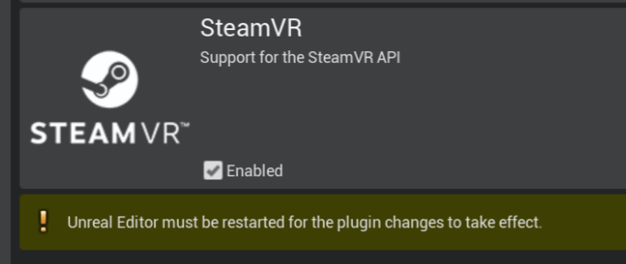

# Installing `DReyeVR` to a working Carla 0.9.11 build   
## Prerequisites
- To continue, this guide assumes the following:
  - You have [SteamVR](https://store.steampowered.com/app/250820/SteamVR/) (free) installed and are using a SteamVR compatible headset. 
    - For eye tracking, we assume you are specifically using an [HTC Vive Pro Eye](https://enterprise.vive.com/us/product/vive-pro-eye-office/) headset, but this is optional as eye tracking can be disabled.
  - If you need help setting up Carla/UE4 for VR. Take a look at [SetupVR.md](SetupVR.md) for a more in-depth explanation. 
  - You have [Unreal Engine 4.24](https://www.unrealengine.com/en-US/blog/unreal-engine-4-24-released) installed.
  - You are running a **Windows 10** or **Linux** x86-64 machine 
    - If you are using **Windows 10**, we recommend using [Windows Subsystem for Linux (WSL)](https://docs.microsoft.com/en-us/windows/wsl/install-win10) for our installer scripts. 
  - **IMPORTANT:** You have a fully functional vanilla [Carla 0.9.11 build](https://carla.readthedocs.io/en/0.9.11/#building-carla) installed
    - This requires the `-b 0.9.11` when cloning (`git clone https://github.com/carla-simulator/carla -b 0.9.11`) from their [GitHub repo](https://github.com/carla-simulator/carla)
    - Use [Building on Linux](https://carla.readthedocs.io/en/0.9.11/build_linux/) or [Building on Windows](https://carla.readthedocs.io/en/0.9.11/build_windows/) to follow their instructions on building CARLA 0.9.11. 
  - (Optional) You have a fully functional default [Carla Scenario Runner v0.9.11 build](https://github.com/carla-simulator/scenario_runner/tree/v0.9.11)
    - Simply clone `git clone https://github.com/carla-simulator/scenario_runner -b v0.9.11` and verify it works with your carla build
- Make sure you compile Carla 0.9.11 and ensure it is working as expected. 
  - ie. `make PythonAPI && make launch` completes without error
  - Additionally, for Linux users who would like to use a more recent version of clang (instead of CARLA's recommended `clang-8` you should copy over the files in `Tools/BuildTools/*.sh` to Carla's `Util/BuildTools/`)
    - Also overwrite `LibCarla/source/test/common/test_streaming.cpp` with `Tools/BuildTools/test_streaming.cpp` to fix [this compilation error](https://github.com/carla-simulator/carla/issues/2416) on newer clang versions. 
    - Note that these `BuildTools` patches include the fix for `make package` on Linux described at the bottom of this file

## Simple install
Technically, the above prerequisites are all you really need to install DReyeVR and get a barebones VR ego-vehicle with **no eyetracking** and **no racing wheel integration**. If this suits your needs, simply skip down to the [Install DReyeVR](Install.md#installing-dreyevr) section of this doc and set the following macros to `false`:
1. `USE_SRANIPAL` in [`EgoSensor.h`](../DReyeVR/EgoSensor.h)
2. `USE_LOGITECH_WHEEL` in [`EgoVehicle.h`](../DReyeVR/EgoVehicle.h)

## First Steps
Before installing `DReyeVR`, we'll also need to install the dependencies:
- ### **Enabling SteamVR in UE4**
  - In the Editor for Carla go to `Settings->Plugins->Virtual Reality->SteamVR` and enable the plugin
  - Note that on Linux this you may need to install it through the [Valve GitHub repo](https://github.com/ValveSoftware/SteamVR-for-Linux)
  - 

- ### **Download `SRanipal`**
  - ## What is this?
    - We are using [HTC's SRanipal plugin](https://developer.vive.com/resources/vive-sense/sdk/vive-eye-tracking-sdk-sranipal/) as the primary means to communicate between Unreal Engine 4 and the Vive's Eye Tracker. 
    - To learn more about SRanipal and for **first-time-setup**, see this [guide on foveated rendering using SRanipal](https://forum.vive.com/topic/7434-getting-started-with-vrs-foveated-rendering-using-htc-vive-pro-eye-unreal-engine/) by HTC developer MariosBikos_HTC
  - You'll need a (free-to-create) Vive developer account to [download](https://hub.vive.com/en-US/download) the following:
    - `VIVE_SRanipalInstaller_1.3.X.Y.msi` -- executable to install Tobii firmware
    - `SDK_v1.3.X.Y.zip` -- includes the Unreal plugin
  - Our work is based off [SRanipal version 1.3.1.1](https://developer.vive.com/resources/vive-sense/sdk/vive-eye-and-facial-tracking-sdk/) which we cannot redistribute.
    - We believe the *newest version* (at time of writing is 1.3.1.1) should also work, but there are several bugs that we dealt with.
      - Bug 1: [Possible Bug in Unreal SDK for Left/Right Eye Gazes](https://forum.vive.com/topic/9306-possible-bug-in-unreal-sdk-for-leftright-eye-gazes/?ct=1613756396)
      - Bug 2: Conflict with using `#define ERROR` with `Carla` that prevents compilation
        - This can be fixed with our local SRanipal files for `SRanipalEye_Framework.*`, in particular we replace `ERROR` with `ERROR_SRANIPAL` as below.
        - Replace the existing files with our `SRanipalEye_Framework.h` and `SRanipalEye_Framework.cpp`
          - `SRanipal/Source/SRanipalEye/Private/SRanipalEye_Framework.cpp`
          - `SRanipal/Source/SRanipalEye/Public/SRanipalEye_Framework.h`
    - You **must** fix **Bug 2** with our file replacements in order to compile, but *Bug 1* is more benign.
      - if *Bug 1* still occurs in the latest `SRanipal` then you can edit the macro `SRANIPAL_EYE_SWAP_FIXED` in `EgoSensor.h` to `true`. This simply swaps the the `Right->GazeRay` and `Left->GazeRay` in [`EgoSensor.cpp`](../DReyeVR/EgoSensor.cpp) as shown below
  - It is recommended to re-calibrate the SRanipal eye tracker plugin for every new participant in an experiment. To see how to do this check out this [guide on foveated rendering using SRanipal](https://forum.vive.com/topic/7434-getting-started-with-vrs-foveated-rendering-using-htc-vive-pro-eye-unreal-engine/) by HTC developer MariosBikos_HTC
- ### **Installing SRanipal**
  - After downloading the `.zip` file, unzipping it should present a directory similar to this
    - ```
      SDK
      ├── 01_C/
      ├── 02_Unity/
      ├── 03_Unreal/
      ├── Eye_SRanipal_SDK_Guide.pdf
      └── Lip_SRanipal_SDK_Guide.pdf
      ```
    - Then, unzip the SRanipal unreal plugin and copy over the `03_Unreal/Plugins/SRanipal/` directory to the Carla installation
    - ```bash
      # in SDK/
      cd 03_Unreal
      unzip Vive-SRanipal-Unreal-Plugin.zip # creates the PLugins/SRanipal folder
      # assumes CARLA_ROOT is defined, else just use your Carla path
      cp -r Plugins/SRanipal $CARLA_ROOT/Unreal/CarlaUE4/Plugins/
      ```
- ### **Installing Logitech Wheel Plugin**
  - This is only for those who have a Logitech steering wheel/pedals driving setup. This hardware is not required to experience the VR experience (you can simply use keyboard/mouse) but greatly adds to the immersion and allows for granular analog controls. 
    - For reference, we used this [Logitech G923 Racing Wheel & Pedals](https://www.logitechg.com/en-us/products/driving/driving-force-racing-wheel.html).
  - We'll be using this [LogitechWheelPlugin](https://github.com/drb1992/LogitechWheelPlugin) to interact with UE4 and map hardware inputs to actions.
    - Clone the repo and move the requisite folder to the Carla plugins folder
    - ```bash
      git clone https://github.com/drb1992/LogitechWheelPlugin
      mv LogitechWheelPlugin/LogitechWheelPlugin $CARLA_ROOT/Unreal/CarlaUE4/Plugins
      ```
    - You should then see a Logitech Plugin enabled when you boot up the editor again:
    - 
  - Unfortunately, there is a bug with this plugin as well where the header (public) files are in the source (private) directory. In order to compile with Carla+DReyeVR you'll need to move all the `.h` files from `private/` to `public/`.
    - ```bash
      # in LogitechWheelPlugin/
      mv Source/LogitechWheelPlugin/Private/*.h Source/LogitechWheelPlugin/Public
      ```
    - You should then see a `source/` directory like this (upon running `tree` or something similar)
    - ```bash
      ├── Source
      └── LogitechWheelPlugin
          ├── LogitechWheelPlugin.Build.cs
          ├── Private
          │   ├── LogitechBPLibrary.cpp
          │   ├── LogitechWheelInputDevice.cpp
          │   └── LogitechWheelPlugin.cpp
          └── Public # all the header files should show up here 
              ├── ILogitechWheelPlugin.h
              ├── LogitechBPLibrary.h
              ├── LogitechSteeringWheelLib.h
              ├── LogitechWheelInputDevice.h
              └── LogitechWheelPluginPrivatePCH.h
      ```
- ### **[OPTIONAL]Using Conda for the PythonAPI**
  - While not at all required for DReyeVR, for those interested in using an Anaconda environment for their PythonAPI have to jump through a couple more hoops to get started:
  - To begin working with the `PythonAPI` in a `Carla` based Anaconda environment you can follow [this guide](https://github.com/carla-simulator/carla/issues/1054) to create the environment. If doing work with the `python` clients it is advisable to use a `Conda` environment. This is especially useful for avoiding the `ModuleNotFoundError: No module named 'carla'` errors that occur when you're missing `Carla` python.
  ```properties
  # in /PATH/TO/CARLA/
  conda create --name carla python=3.7
  conda activate carla
  ```
  - Note that we've had some experience with compiling Boost 1.7.1 (required by Carla) being a problem when using an Anaconda python version. In which case the solution was to edit the boost source (make sure not to redownload it in Setup.sh) in Build/boost-1.72.0-c8-source/tools/build/src/tools/python.jam:547 to `python3m` instead of just `python3` for Conda.

- ### Sanity Check
  - After installing these plugins, you should see a `Unreal/CarlaUE4/Plugins` that looks like this:
  - ```
    Plugins
    ├── Carla/
    ├── CarlaExporter/
    ├── LogitechWheelPlugin/
    └── SRanipal/
    ```
  
## Installing `DReyeVR`
(Once you are done with this step, you should have a carla repo that looks just like this [Carla fork](https://github.com/HARPLab/carla/tree/DReyeVR-0.9.11) we created with the [`install.sh`](../install.sh) script pre-applied.)

With all previous steps complete, run the [install.sh](../install.sh) script to copy all the requisite files over to Carla
- Note this is a `bash` (`.sh`) script so it would be ideal to use [WSL](https://docs.microsoft.com/en-us/windows/wsl/install) if on Windows.
- The script requires that `git` is installed and available on your shell.
- You only need to install to a CARLA directory, ScenarioRunner is optional 
```sh
# in DReyeVR:
./install.sh /path/to/carla # only installs to Carla
./install.sh /path/to/carla /path/to/scenario-runner # installs both
```
The script will first check if each directory matches the expected version (`0.9.11` for Carla and `v0.9.11` for ScenarioRunner) using git and then proceed with the installation. 

As long as you have no errors in the previous sections (see [`Install.md`](Docs/Install.md)), you should be able to just build the `Carla` project with our `DReyeVR` files as follows:

## Building `DReyeVR`
- If you are not interested in using SRanipal or the LogitechWheelPlugin, you can disable these at compile-time by toggling the following macros (set to `false`):
  1. `USE_SRANIPAL` in [`EgoSensor.h`](../DReyeVR/EgoSensor.h)
  2. `USE_LOGITECH_WHEEL` in [`EgoVehicle.h`](../DReyeVR/EgoVehicle.h)
- Open the project directory in any terminal (Linux) or `Windows x64 Native Tools Command Prompt for VS 2017` (Windows)
  - Run `make PythonAPI && make launch` (the `PythonAPI` should be build first)
- To build a package, run `make package` which should work as long as the editor version compiles
  - Note that on Linux there is a bug in Carla 0.9.11 when running `make package` as described [here](https://github.com/carla-simulator/carla/issues/3758). Fortunately, the fix is easy:
    ```bash
    cd $CARLA_ROOT/Util/BuildTools/
    # Open Package.sh in your favourite editor
    ...
    copy_if_changed "./Plugins/" "${DESTINATION}/Plugins/" # <-- change this (Package.sh:166)
    copy_if_changed "./Unreal/CarlaUE4/Plugins/" "${DESTINATION}/Plugins/" # <-- to this (Package.sh:166)
    ```

Then, with the package built, run the Carla executable in VR mode with:
```bash
# on Linux
cd /PATH/TO/CARLA/Dist/CARLA_SHIPPING_*/LinuxNoEditor/
./CarlaUE4.sh -vr

# on Windows x64 Visual C++ Toolset
cd \PATH\TO\CARLA\Build\UE4Carla\0.9.11-*\WindowsNoEditor\
CarlaUE4.exe -vr

# Optional flag: -quality-level=Low
```
**NOTE:** To greatly boost the framerates without losing much visual fidelity you can run with the additional argument `-quality-level=Low` which we modified from vanilla Carla to preserve the same rendering distance.

**NOTE 2** You also don't necessarily NEED to run DReyeVR in VR. If you omit the `-vr` flag then you will be greeted with a flat-screen Carla game with the same features available for DReyeVR, just not in VR. 

## Now what?

Now that you've successfully installed DReyeVR continue to [`Usage.md`](Usage.md) to learn how to use DReyeVR for your own VR driving research simulator. 