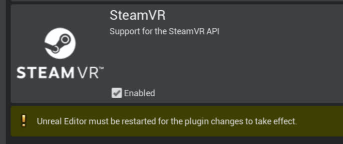
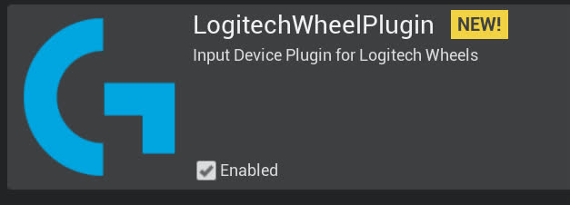

# Installing `DReyeVR` to a working Carla 0.9.13 build   
## Prerequisites
- To continue, this guide assumes the following:
  - You have [SteamVR](https://store.steampowered.com/app/250820/SteamVR/) (free) installed and are using a SteamVR compatible headset. 
    - For eye tracking, we assume you are specifically using an [HTC Vive Pro Eye](https://enterprise.vive.com/us/product/vive-pro-eye-office/) headset, but this is optional as eye tracking can be disabled.
  - If you need help setting up Carla/UE4 for VR. Take a look at [SetupVR.md](SetupVR.md) for a more in-depth explanation. 
  - You have [Unreal Engine 4.26 (Carla)](https://github.com/carlaunreal/unrealengine) installed from source
    - Note, if the link does not work for you, you probably need to [join the Epic Games Organization](https://www.unrealengine.com/en-US/ue4-on-github)
  - You are running a **Windows 10** or **Linux** x86-64 machine 
    - If you are using **Windows 10**, we recommend using [Windows Subsystem for Linux (WSL)](https://docs.microsoft.com/en-us/windows/wsl/install-win10) for our installer scripts. 
  - **IMPORTANT:** You have a fully functional vanilla [Carla 0.9.13 build](https://carla.readthedocs.io/en/0.9.13/#building-carla) installed
    - This requires the `-b 0.9.13` when cloning (`git clone https://github.com/carla-simulator/carla -b 0.9.13`) from their [GitHub repo](https://github.com/carla-simulator/carla)
    - Use [Building on Linux](https://carla.readthedocs.io/en/0.9.13/build_linux/) or [Building on Windows](https://carla.readthedocs.io/en/0.9.13/build_windows/) to follow their instructions on building CARLA 0.9.13. 
  - (Optional) You have a fully functional default [Carla Scenario Runner v0.9.13 build](https://github.com/carla-simulator/scenario_runner/tree/v0.9.13)
    - Simply clone `git clone https://github.com/carla-simulator/scenario_runner -b v0.9.13` and verify it works with your carla build
- **Tl;dr**:Make sure you compile Carla 0.9.13 and ensure it is working as expected. 
  - ie. `make PythonAPI && make launch` completes without error
  - Can verify unit tests pass with `make check`


## DReyeVR installation command summary
<details>

**NOTE** Since DReyeVR is still installed using `bash`, on Windows you'll need [WSL](https://docs.microsoft.com/en-us/windows/wsl/install) installed.
<summary> Show command lines to install and build DReyeVR </summary>

```bash
# NOTE: On windows, this can almost all be done in WSL, except the make commands which need
# to be done in the "Windows x64 Native Tools Command Prompt for VS 2019"
mkdir CarlaDReyeVR && cd CarlaDReyeVR # doing everything in this "CarlaDReyeVR" directory

#####################################################
######### install Carla's UnrealEngine fork #########
#####################################################
# Linux: https://carla.readthedocs.io/en/0.9.13/build_linux/#unreal-engine
# Windows: https://carla.readthedocs.io/en/0.9.13/build_windows/#unreal-engine

#####################################################
################### install Carla ###################
#####################################################
# Linux: https://carla.readthedocs.io/en/0.9.13/build_linux/
# Windows: https://carla.readthedocs.io/en/0.9.13/build_windows/
git clone https://github.com/carla-simulator/carla -b 0.9.13
cd carla
./Update.sh
make PythonAPI && make launch

#####################################################
############## install DReyeVR plugins ##############
#####################################################
# (optional) install SRanipal (https://developer.vive.com/resources/vive-sense/eye-and-facial-tracking-sdk/download/latest/)
mv /PATH/TO/SRANIPALPLUGIN/SDK/03_Unreal/Plugins/SRanipal Unreal/CarlaUE4/Plugins/ # install to carla

# (optional) install LogitechWheelPlugin
git clone https://github.com/HARPLab/LogitechWheelPlugin
mv LogitechWheelPlugin/LogitechWheelPlugin Unreal/CarlaUE4/Plugins/ # install to carla

cd .. # back to main directory

#####################################################
############## install scenario_runner ##############
#####################################################
# (optional) while you don't NEED scenario runner, it is certainly useful from a research pov
git clone https://github.com/carla-simulator/scenario_runner -b v0.9.13

#####################################################
################## install DReyeVR ##################
#####################################################
git clone https://github.com/HARPLab/DReyeVR
cd DReyeVR
# the CARLA= and SR= variables are optional
make install CARLA=../carla SR=../scenario_runner
# or
make install CARLA=../carla
make install SR=../scenario_runner

make patch-sranipal CARLA=../carla # only applies if you use SRanipal

# run filesystem checks after installing
make check CARLA=../carla
cd ..

#####################################################
################## build everything #################
#####################################################
cd carla
make PythonAPI  # build the PythonAPI (and LibCarla) again
make launch     # launch in editor
make package    # create an optimized package
make check      # run Carla unit tests
```
</details>

## Simple install
Technically, the above prerequisites are all you really need to install DReyeVR and get a barebones VR ego-vehicle with **no eyetracking** and **no racing wheel integration**. If this suits your needs, simply skip down to the [Install DReyeVR](Install.md#installing-dreyevr) section of this doc and set the following variables in `Unreal/CarlaUE4/Source/CarlaUE4/CarlaUE4.Build.cs` to `false`:
```c#
////////////////////////////////////////////////////////////////////////////////////
// Edit these variables to enable/disable features of DReyeVR
bool UseSRanipalPlugin = true;
bool UseLogitechPlugin = true;
////////////////////////////////////////////////////////////////////////////////////
```
- NOTE: you only need to install the SRanipal plugin if `UseSRanipalPlugin` is enabled, and similarly you only need to install the Logitech plugin if `UseLogitechPlugin` is enabled. 

## First Steps
Before installing `DReyeVR`, we'll also need to install the dependencies:
- ### **Enabling SteamVR in UE4**
  - In the Editor for Carla go to `Settings->Plugins->Virtual Reality->SteamVR` and enable the plugin
  - Note that on Linux this you may need to install it through the [Valve GitHub repo](https://github.com/ValveSoftware/SteamVR-for-Linux)
  - 

- ### **Download `SRanipal`**
  - ## What is this?
    - We are using [HTC's SRanipal plugin](https://developer.vive.com/resources/vive-sense/sdk/vive-eye-tracking-sdk-sranipal/) as the primary means to communicate between Unreal Engine 4 and the Vive's Eye Tracker. 
    - To learn more about SRanipal and for **first-time-setup**, see this [guide on foveated rendering using SRanipal](https://forum.vive.com/topic/7434-getting-started-with-vrs-foveated-rendering-using-htc-vive-pro-eye-unreal-engine/) by HTC developer MariosBikos_HTC
  - You'll need a (free-to-create) Vive developer account to [download](https://hub.vive.com/en-US/download) the following:
    - `VIVE_SRanipalInstaller_1.3.X.Y.msi` -- executable to install Tobii firmware
    - `SDK_v1.3.X.Y.zip` -- includes the Unreal plugin
  - Our work has been tested on [SRanipal version 1.3.3.0](https://developer.vive.com/resources/vive-sense/sdk/vive-eye-and-facial-tracking-sdk/) (latest version at time of writing) which we cannot redistribute.
    - Bug 1: [Possible Bug in Unreal SDK for Left/Right Eye Gazes](https://forum.vive.com/topic/9306-possible-bug-in-unreal-sdk-for-leftright-eye-gazes/?ct=1613756396)
    - Bug 2: Conflict with using `#define ERROR` with `UE4` that prevents compilation
        - This can be fixed by running the [`patch_sranipal.sh`](../Scripts/patch_sranipal.sh) script in [`Scripts`](../Scripts) once SRanipal is installed
    - You **must** fix **Bug 2** with in order to build, but *Bug 1* is more benign.
      - if *Bug 1* still occurs in the latest `SRanipal` then you can edit the macro `SRANIPAL_EYE_SWAP_FIXED` in `EgoSensor.h` to `true`. This simply swaps the the `Right->GazeRay` and `Left->GazeRay` in [`EgoSensor.cpp`](../DReyeVR/EgoSensor.cpp)
  - It is recommended to re-calibrate the SRanipal eye tracker plugin for every new participant in an experiment. To see how to do this check out this [guide on foveated rendering using SRanipal](https://forum.vive.com/topic/7434-getting-started-with-vrs-foveated-rendering-using-htc-vive-pro-eye-unreal-engine/) by HTC developer MariosBikos_HTC
- ### **Installing SRanipal**
  - After downloading the `.zip` file, unzipping it should present a directory similar to this
    - ```
      SDK
      - 01_C/
      - 02_Unity/
      - 03_Unreal/
      - Eye_SRanipal_SDK_Guide.pdf
      - Lip_SRanipal_SDK_Guide.pdf
      ```
    - Then, unzip the SRanipal unreal plugin and copy over the `03_Unreal/Plugins/SRanipal/` directory to the Carla installation
    - ```bash
      # in SDK/
      cd 03_Unreal
      unzip Vive-SRanipal-Unreal-Plugin.zip # creates the PLugins/SRanipal folder
      # assumes CARLA_ROOT is defined, else just use your Carla path
      cp -r Plugins/SRanipal $CARLA_ROOT/Unreal/CarlaUE4/Plugins/
      ```
- ### **Installing Logitech Wheel Plugin**
  - This is only for those who have a Logitech steering wheel/pedals driving setup. This hardware is not required to experience the VR experience (you can simply use keyboard/mouse) but greatly adds to the immersion and allows for granular analog controls. 
    - For reference, we used this [Logitech G923 Racing Wheel & Pedals](https://www.logitechg.com/en-us/products/driving/driving-force-racing-wheel.html).
  - We'll be using this [LogitechWheelPlugin](https://github.com/HARPLab/LogitechWheelPlugin) to interact with UE4 and map hardware inputs to actions.
    - Clone the repo and move the requisite folder to the Carla plugins folder
    - ```bash
      git clone https://github.com/HARPLab/LogitechWheelPlugin
      mv LogitechWheelPlugin/LogitechWheelPlugin $CARLA_ROOT/Unreal/CarlaUE4/Plugins
      ```
    - You should then see a Logitech Plugin enabled when you boot up the editor again:
    - 
- ### **[OPTIONAL]Using Conda for the PythonAPI**
  - While not at all required for DReyeVR, for those interested in using an Anaconda environment for their PythonAPI have to jump through a couple more hoops to get started:
  - To begin working with the `PythonAPI` in a `Carla` based Anaconda environment you can follow [this guide](https://github.com/carla-simulator/carla/issues/1054) to create the environment. If doing work with the `python` clients it is advisable to use a `Conda` environment. This is especially useful for avoiding the `ModuleNotFoundError: No module named 'carla'` errors that occur when you're missing `Carla` python.
  ```properties
  # in /PATH/TO/CARLA/
  conda create --name carla python=3.7.2
  conda activate carla
  ```
  - **NOTE (Linux)**: You might run into a problem when compiling Boost 1.72.0 (required by `LibCarla`).
    <details>

    <summary> Show instructions to get Anaconda working on Linux </summary>

    - ```bash
      # find anaconda install:
      which python3
      ...
      > PATH/TO/ANACONDA/envs/carla/bin/python3 # example output
      # go to carla/install dir from here
      cd PATH/TO/ANACONDA/envs/carla/install
      # create a symlink between python3.7 -> python3.7m
      ln -s python3.7m python3.7
      ```
      Now when you `make LibCarla` again, the `boost` errors should be resolved.
      - For more information see the bottom of this [SO post](https://stackoverflow.com/questions/42839382/failing-to-install-boost-in-python-pyconfig-h-not-found)

    </details>

  - **NOTE (Windows)**: Anaconda is not natively supported by CARLA, but it is very useful when managing multiple versions of CARLA and containerizing all the CARLA python dependencies.
    <details>

    <summary> Show instructions to get Anaconda working on Windows </summary>

      1. Create your environment
          ```bat
          conda create --name carla python=3.7.2
          conda activate carla
          ```
      2. When trying to `make PythonAPI` you'll need to apply [this fix](https://github.com/carla-simulator/carla/issues/2881#issuecomment-699452386) (Replace `py` with `python` in `BuildPythonAPI.bat`)
          ```bat
          make PythonAPI
          ```
      3. Add carla to "path" to locate the PythonAPI and ScenarioRunner. But since Anaconda [does not use the traditional `PYTHONPATH`](https://stackoverflow.com/questions/37006114/anaconda-permanently-include-external-packages-like-in-pythonpath) you'll need to:
          - 3.1. Create a file `carla.pth` in `\PATH\TO\ANACONDA\envs\carla\Lib\site-packages\`
          - 3.2. Insert the following content into `carla.pth`:
            ```bat
              C:\PATH\TO\CARLA\PythonAPI\carla\dist
              C:\PATH\TO\CARLA\PythonAPI\carla\agents
              C:\PATH\TO\CARLA\PythonAPI\carla
              C:\PATH\TO\CARLA\PythonAPI
              C:\PATH\TO\CARLA\PythonAPI\examples
              C:\PATH\TO\SCENARIO_RUNNER\
            ```
      4. Install the specific carla wheel (`whl`) to Anaconda
          ```bat
          conda activate carla
          pip install --no-deps PATH\TO\CARLA\PythonAPI\carla\dist\carla-0.9.13-cp37-cp37m-win_amd64.whl
          cd \PATH\TO\SCENARIO_RUNNER
          pip install -r requirements.txt # install all SR dependencies
          conda install numpy
          ```
      5. Finally, there are some problems with `shapely` (SR dependency) and Conda. Luckily the solution is simple:
          - Copy the files:
            - `PATH\TO\ANACONDA\envs\carla\Lib\site-packages\shapely\DLLs\geos.dll`
            - `PATH\TO\ANACONDA\envs\carla\Lib\site-packages\shapely\DLLs\geos_c.dll`
          - To destination:
            - `PATH\TO\ANACONDA\envs\carla\Library\bin\`
      6. Now finally, you should be able to verify all PythonAPI actions work as expected via:
          ```bat
          conda activate carla
          python
          >>> Python 3.7.2 (default, Feb 21 2019, 17:35:59) [MSC v.1915 64 bit (AMD64)] :: Anaconda, Inc. on win32
          >>> Type "help", "copyright", "credits" or "license" for more information.
          >>> import carla
          >>> from DReyeVR_utils import find_ego_vehicle
          >>> from scenario_runner import ScenarioRunner
          ```
          With all these imports passing (no error/warning messages), you're good to go!
  </details>

- ### Sanity Check
  - After installing these plugins, you should see a `Unreal/CarlaUE4/Plugins` that looks like this:
  - ```
    Plugins
    - Carla/
    - CarlaExporter/
    - LogitechWheelPlugin/
    - SRanipal/
    ```
  
## Installing `DReyeVR`
(Once you are done with this step, you should have a carla repo that looks just like this [Carla fork](https://github.com/HARPLab/carla/tree/DReyeVR-0.9.13) we created with the installation (and other minor things) pre-applied.)

- **IMPORTANT** The installation requires that `python` and `git` are available on your shell.
- You only need to install to a CARLA directory, ScenarioRunner is optional 

```bash
# the CARLA= and SR= variables are optional
make install CARLA=../carla SR=../scenario_runner
# or
make install CARLA=../carla
make install SR=../scenario_runner

# run filesystem checks after installing
make check CARLA=../carla
make patch-sranipal CARLA=../carla # only applies if you use SRanipal
```
**NOTE:** to learn more about how the DReyeVR `make` system works, see [`Scripts/README.md`](../Scripts/README.md)

## Upgrading `DReyeVR`
If you currently have an older version of `DReyeVR` installed and want to upgrade to a newer version, the recommended strategy is as follows:

**IMPORTANT:** the `DReyeVR` clean script will overwrite and reset the Carla repository you specify, so make your backups now if you have any unstaged code. (`git reset --hard HEAD` and `git clean -fd` will be invoked, so if you commit your local changes they will be safe)

```bash
# first go to CARLA and clean it so no old DReyeVR builds linger
cd /PATH/TO/Carla/
make clean

# it is a good idea to clean the Content/ directory which is not tracked by Carla's git system
rm -rf Unreeal/CarlaUE4/Content/
./Update.sh # re-install the Content fresh from Carla's servers (use .bat on Windows)

# next, go to DReyeVR and get the latest updates
cd /PATH/TO/DReyeVR/
git pull origin main # or dev, or whatever branch


# next, run the DReyeVR-cleaner to automatically hard-reset the Carla repo
# accept the prompt to hard-clean CARLA, note that this will reset tracked and remove untracked files
make clean CARLA=/PATH/TO/CARLA SR=/PATH/TO/SR # both args are optional

# now, you can cleanly install DReyeVR over Carla again
make install CARLA=/PATH/TO/CARLA SR=/PATH/TO/SR # both args are optional

# its a good idea to check that the Carla repository has all the expected files
make check CARLA=/PATH/TO/CARLA SR=/PATH/TO/SR # both args are optional

# finally, you can go back to Carla and rebuild
cd /PATH/TO/Carla
make PythonAPI
make launch
make package
```

As long as you have no errors in the previous sections, you should be able to just build the `Carla` project with our `DReyeVR` files as follows:

## Building `DReyeVR`
- If you are not interested in using SRanipal or the LogitechWheelPlugin, you can disable these at compile-time by changing the variables in `Unreal/CarlaUE4/Source/CarlaUE4/CarlaUE4.Build.cs` to `false`:
  - ```c#
    //////////////////////////////////////////////////////////////
    // Edit these variables to enable/disable features of DReyeVR
    bool UseSRanipalPlugin = true;
    bool UseLogitechPlugin = true;
    ...
    //////////////////////////////////////////////////////////////
    ```
- Open the project directory in any terminal (Linux) or `Windows x64 Native Tools Command Prompt for VS 2019` (Windows)
```bash
make PythonAPI  # build the PythonAPI & LibCarla

make launch     # build the UE4 game in editor

make package    # build the optimized UE4 packaged game
```

With the package built, run the Carla executable in VR mode with:
```bash
# on Linux
cd /PATH/TO/CARLA/Dist/CARLA_Shipping_0.9.13-dirty/LinuxNoEditor/
./CarlaUE4.sh -vr

# on Windows x64 Visual C++ Toolset
cd \PATH\TO\CARLA\Build\UE4Carla\0.9.13-dirty\WindowsNoEditor\
CarlaUE4.exe -vr

# Optional flag: -quality-level=Low
```
**NOTE:** To greatly boost the framerates without losing much visual fidelity you can run with the additional argument `-quality-level=Low` which we modified from vanilla Carla to preserve the same rendering distance.

**NOTE 2** You also don't necessarily NEED to run DReyeVR in VR. If you omit the `-vr` flag then you will be greeted with a flat-screen Carla game with the same features available for DReyeVR, just not in VR. 

## Now what?

Now that you've successfully installed DReyeVR continue to [`Usage.md`](Usage.md) to learn how to use DReyeVR for your own VR driving research simulator.