# How to add your own EgoVehicle

A guide from how to add your own custom EgoVehicle from an existing Carla vehicle that you can then use in DReyeVR. Showcasing the minimal required steps to add an **ambulance** to be the new DReyeVR EgoVehicle. 

## Prerequisites:
- You should have DReyeVR installed and functioning correctly
- You should probably take a look at [Model.md](Model.md) in case you want to modify the static mesh of your new vehicle:
    - Ex. creating high-poly mirror meshes
    - Ex. detatching the steering wheel for use as a dynamic prop (moves with the animation)

## 1. Choose which vehicle to add
1. Since the DReyeVR EgoVehicle is a child-instance of the `ACarlaWheeledVehicle`, you should use a Carla vehicle for the base class of your desired Vehicle. For this tutorial we will use the Ambulance as an example, but any Carla vehicle should do fine.
    - For Vehicle `XYZ`
    - The blueprint files are located in `Unreal/CarlaUE4/Content/Carla/Blueprints/Vehicles/XYZ/BP_XYZ.uasset`
    - The static mesh files are located in `Unreal/CarlaUE4/Content/Carla/Static/Vehicles/XWheeled/XYZ/`
2. Once you have decided on a vehicle, create this structure by copying (in Unreal Editor) the blueprint file. 
    - Do the same with any other mesh components that you'll want to add.
    - You'll want the file structure to match the existing EgoVehicles:
    ```
    CarlaUE4/Content/DReyeVR/
    ├── EgoVehicle
    │   ├── Extra
    │   ├── Jeep
    │   ├── Mustang66
    │   ├── Ambulance # <-- your new EgoVehicle
    │   ├── TeslaM3   # <-- default for DReyeVR
    │   └── Vespa
    ...
    ```
    - Inside your `XYZ/` folder, you'll want to copy your new BP_XYZ asset (do this from the editor so that cached paths can be updated) and create any additional folders in here that you might want (ex. `Mesh`, `Mirrors`, `SteeringWheel`, `Tires`, are a few examples). 
    - It is best to perform these asset file modifications within the Editor. You can copy the files from within the content browser to other folders by click+dragging to get this pop-up:

        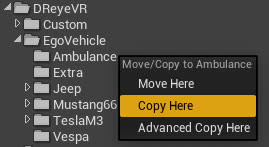

**NOTE**: If you want to edit the vehicle mesh at all, this is where you'd want to do it. You will probably want to build off the existing static meshes in the `Static` directory. 

## 2. Reparent the vehicle blueprint
(For the sake of this tutorial, we'll assume the `XYZ=Ambulance`)
1. Open the `Content/DReyeVR/EgoVehicle/Ambulance/BP_Ambulance` asset you just copied from the content browser
2. Select `Class Defaults` then in the top right (`Class Options`) select the `Parent Class` and search for `EgoVehicle` to reparent (as in the figure below). This effectively reorganizes the blueprint's base class from `BaseVehiclePawn` (the Carla default) to `EgoVehicle` (the DReyeVR C++ class, which still inherits from BaseVehiclePawn). 
    - There will be a warning pop-up regarding data loss, you should proceed (it is purely additive). 
    - **NOTE** if the blueprint ever gets corrupted, you should first try reparenting back to the `BaseVehiclePawn` (the original parent) and then back to the DReyeVR `EgoVehicle`. 
    - 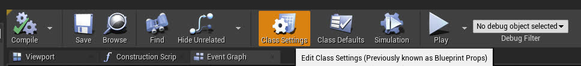
        - Demonstrating class setting button, used to edit this BP's class instance
    - 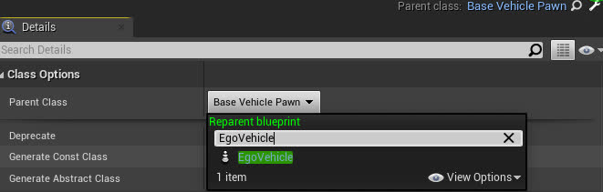
        - Demonstrating the reparenting button, select the dropdown and search for a compatible class to reparent with `BaseVehiclePawn` (Carla) or `EgoVehicle` (DReyeVR).
3. Now this vehicle is technically a DReyeVR EgoVehicle!

## 3. Add the new config file and code
Now, to actually register this new blueprint with DReyeVR and have it available to spawn you'll need to add two bits to the code:

1. Add the name of your new vehicle (for example `"Ambulance"` for the `BP_Ambulance` blueprint we inherited) to the list of available EgoVehicles in [`DReyeVRFactory.h`](../../DReyeVR/DReyeVRFactory.h).
    ```c++
    // place the names of all your new custom EgoVehicle types here:
    /// IMPORTANT: make sure these match the ConfigFile AND Blueprint!!
    // We expect Config/EgoVehicle/XYZ.ini and Content/DReyeVR/EgoVehicles/XYZ/BP_XYZ.uasset
    const std::vector<std::string> VehicleTypes = {
        "TeslaM3",   // Tesla Model 3 (Default)
        "Mustang66", // Mustang66
        "Jeep",      // JeepWranglerRubicon
        "Vespa"      // Vespa (2WheeledVehicles)
        "Ambulance", // <-- the new vehicle! (for this tutorial)
        // add more here
    };
    ```
2. Add a new config file (to `Unreal/CarlaUE4/Config/EgoVehicles/`) that is used to parameterize this vehicle. This allows DReyeVR to know where to place things such as the camera root location (driver's seat), mirrors, steering wheel, etc. and this [`ConfigFile`](../../DReyeVR/ConfigFile.h) can be extended to support many run-time combinations. 
    - You'll need to make sure the config file has the EXACT same name as your new EgoVehicle (this is how they are read). We recommend copying an existing config file (default is `TeslaM3.ini` and renaming as follows):
        ```
        CarlaUE4/Config/
        ├── ...
        ├── DReyeVRConfig.ini
        ├── ...
        ├── EgoVehicles/
        │   ├── Jeep.ini
        │   ├── Mustang66.ini
        │   ├── Ambulance.ini # <-- your new file!
        │   ├── TeslaM3.ini
        │   └── Vespa.ini
        ├── ...
        ...
        ```
    - Then you'll probably want to edit some of the contents of this file to match the EgoVehicle specifications which you can get from the Editor. For instance, the following figure shows that we are going to want to move the VRCameraRoot (head position) to (`108, -40, 158`). 
        - 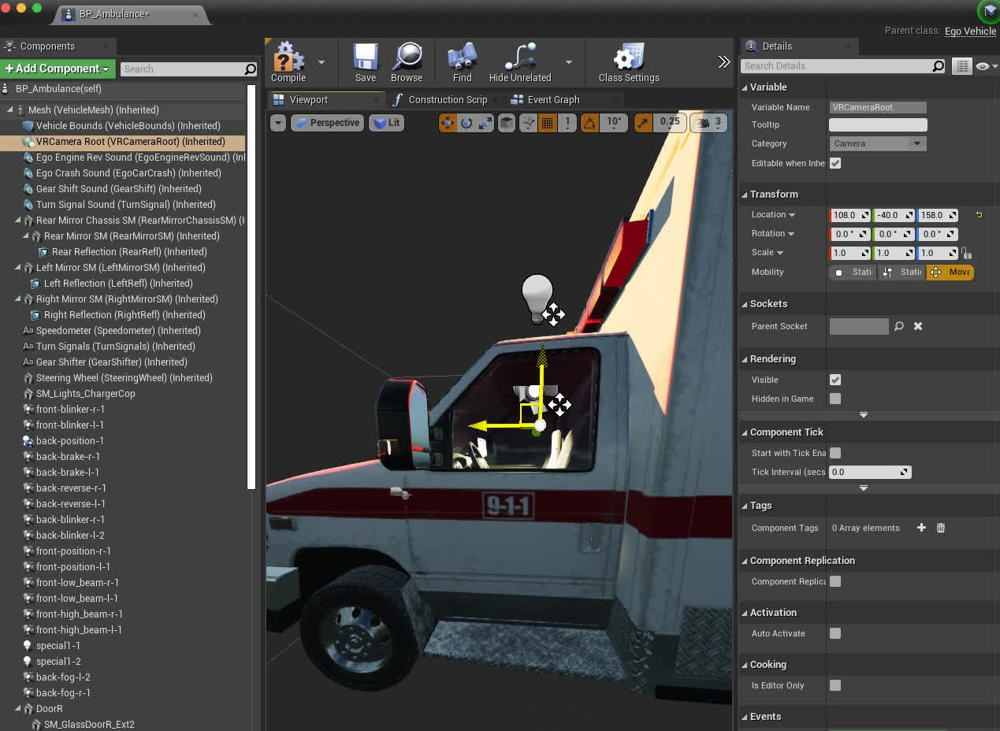
        - You'll probably also want to move the dashboard elements around to whatever fits your preference.
    - **IMPORTANT** You also need to enable the `Start with Tick Enabled` for the Blueprint (`BP_Ambulance` in the Components list) because by default they are disabled for Carla vehicles:
        - 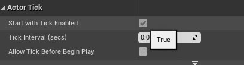
    - You should also notice that assets such as the SteeringWheel & Mirrors don't have any assigned static mesh. You can access these by clicking the component (on the left hierarchy) and assigning a new static mesh (on the right details pane). This bakes the asset directly in the blueprint file, so this only needs to be done once.
        | Example: Mirrors | Example: Steering wheel |
        | --- | --- |
        | 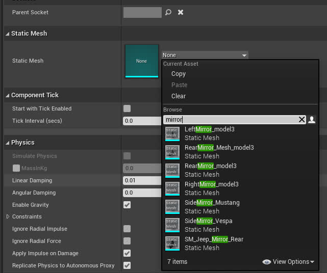 | 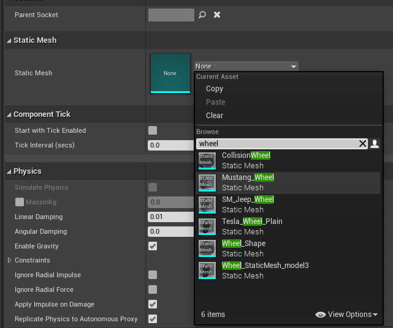
    - Now, open the `Ambulance.ini` file you just created and begin updating the fields (mostly transforms) to match the parameters you care about. Importantly, for the `[Blueprint]::Path` entry, you'll get this path by right-clicking on the Blueprint in the content viewer and selecting `Copy Reference`. 
        - 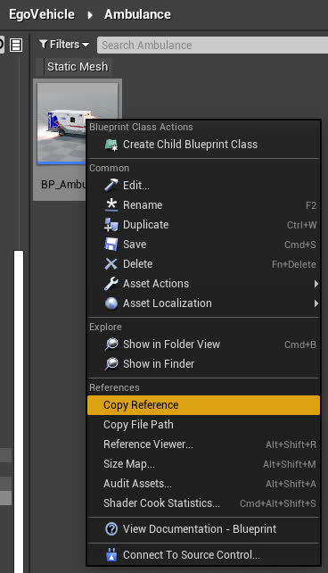
        - Note that transforms are encoded as follows
        ```ini
        # Format: Location XYZ in CM | Rotation Roll/Pitch/Yaw in Degrees | Scale XYZ percent (1=100%)
        ExampleTransform=(X=0.0, Y=0.0, Z=3.0 | R=-45, P=90.0, Y=0 | X=1, Y=1, Z=1)
        ```

## 4. Set the new vehicle to be the DReyeVR default
In the `DReyeVRConfig.ini` general configuration file (for non-vehicle specific parameters) you should set what Vehicle to spawn in by default. This takes the name of the vehicles, which for this example is `Ambulance`. 

```ini
[EgoVehicle]
VehicleType="Ambulance"
```

And thats it! You should now be able to relaunch `make launch` and when you press Play you'll start in your new EgoVehicle. 


## 4. [Optional] Create a new animation
Sometimes, especially when modifying the meshes in blender and exporting/importing them back into Unreal Engine, the vanilla animation asset can get somewhat mangled and not work properly. You will know if the animation is failing if the tires (and steering wheel, if you added one) are not turning while the EgoVehicle is moving.

See Carla's corresponding documentation [here](https://carla.readthedocs.io/en/latest/tuto_A_add_vehicle/#import-and-configure-the-vehicle).

**NOTE** This only works for 4WheeledVehicles as of testing. 2WheeledVehicles are more complicated and not covered in this tutorial. 

### Steps to create a new animation blueprint for Carla/DReyeVR
1. Create a new Animation Blueprint in the Ambulance/Mesh directory (if you have one, else make a new folder `Mesh/` inside `Ambulance`). 
- 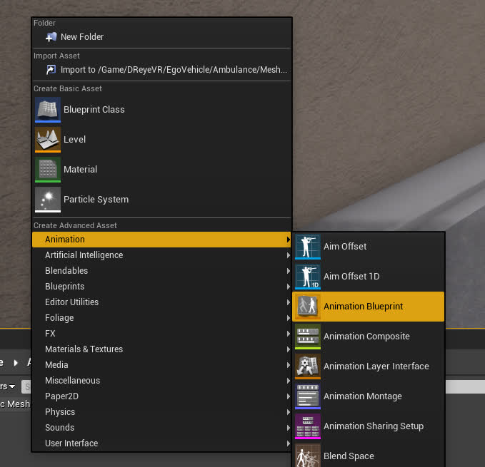
2. Make sure the parent of the animation mesh is set to `VehicleAnimInstance` and the preview skeleton is set to the skeletal mesh of your new vehicle (ex. `SK_Ambulance_Skeleton`)
- 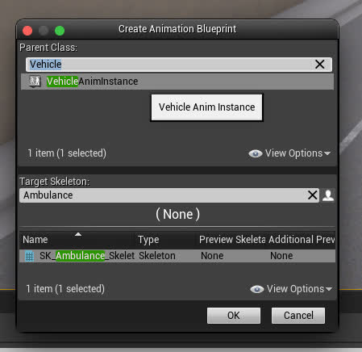
3. Name your new asset to something like `Anim_Ambulance` and open it up. Open the AnimationGraph in the bottom right as shown:
- 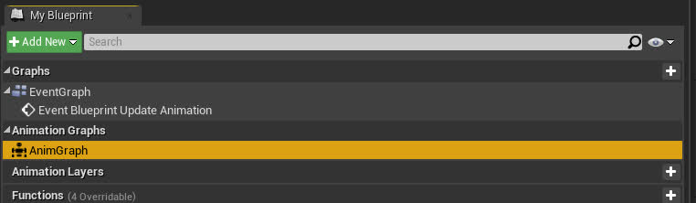
4. Open another nearby animation blueprint (ex. `Content/DReyeVR/EgoVehicle/TeslaM3/Mesh/Animation_model3`) and open its AnimationGraph to copy the first three blueprint nodes that connect to the Output Pose as follows:
- 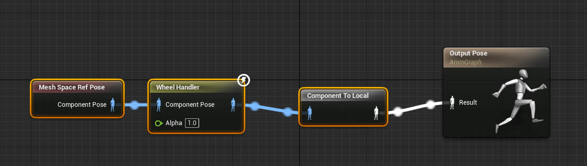
5. Then, back in `Anim_Ambulance`, paste the three nodes you just copied and connect them to the Output Pose:
- 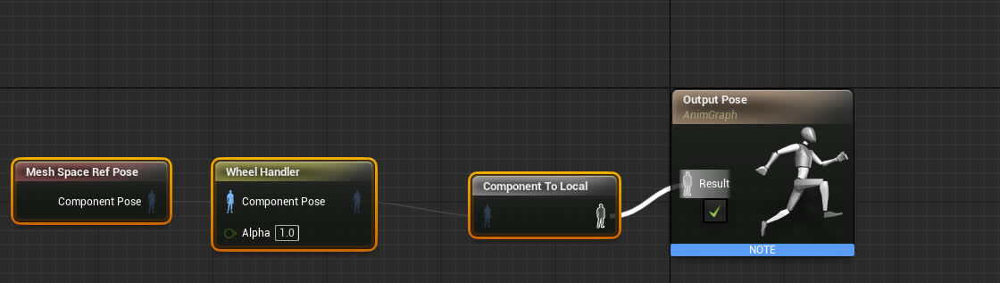
6. Finally, go back to the vehicle blueprint (BP_Ambulance) and in the components section select Mesh, then in the (right) details panel change the animation class to your new `Anim_Ambulance` like this:
- 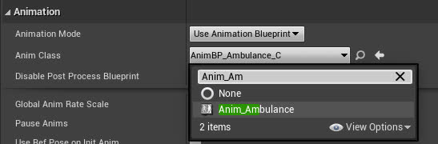
