# Level Of Detail modes in UE4

## What?
LOD = "Level of Detail"

Ever noticed how in major video games/3d programs most of the models/textures decrease in quality (polygon count/resolution) when further away? This makes sense as an optimization, far away things can probably use less compute power. This is best explained in this [UE4 documentation](https://docs.unrealengine.com/4.26/en-US/WorkingWithContent/Types/StaticMeshes/HowTo/AutomaticLODGeneration/). 

Here's an example of the `SM_Tesla` static mesh provided by Carla
| LOD 0 (14,406 triangles)       | LOD 1 (3,601 triangles)        | LOD 2 (1,799 triangles)        | LOD 3 (864 triangles)          |
| ------------------------------ | ------------------------------ | ------------------------------ | ------------------------------ |
| 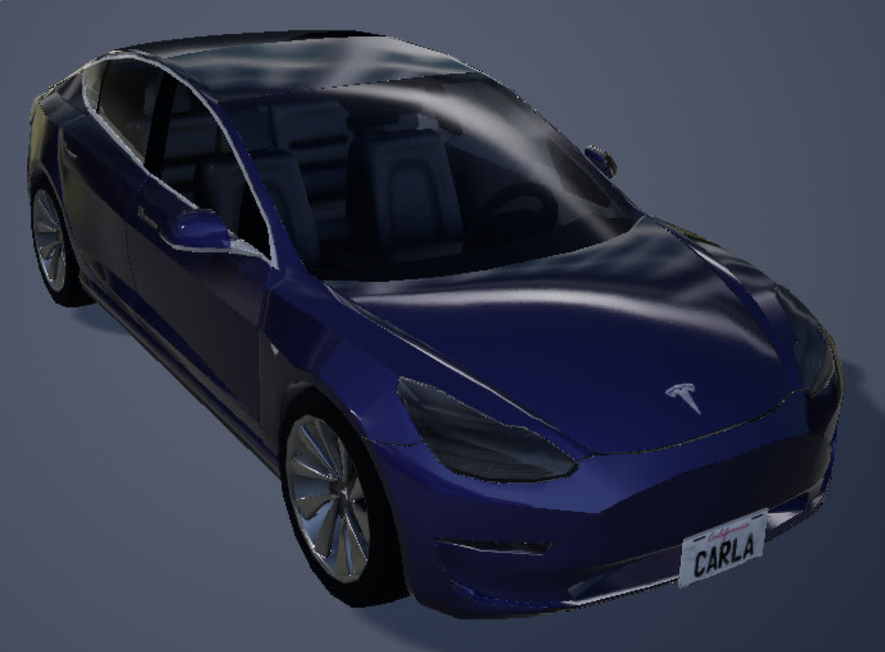 | 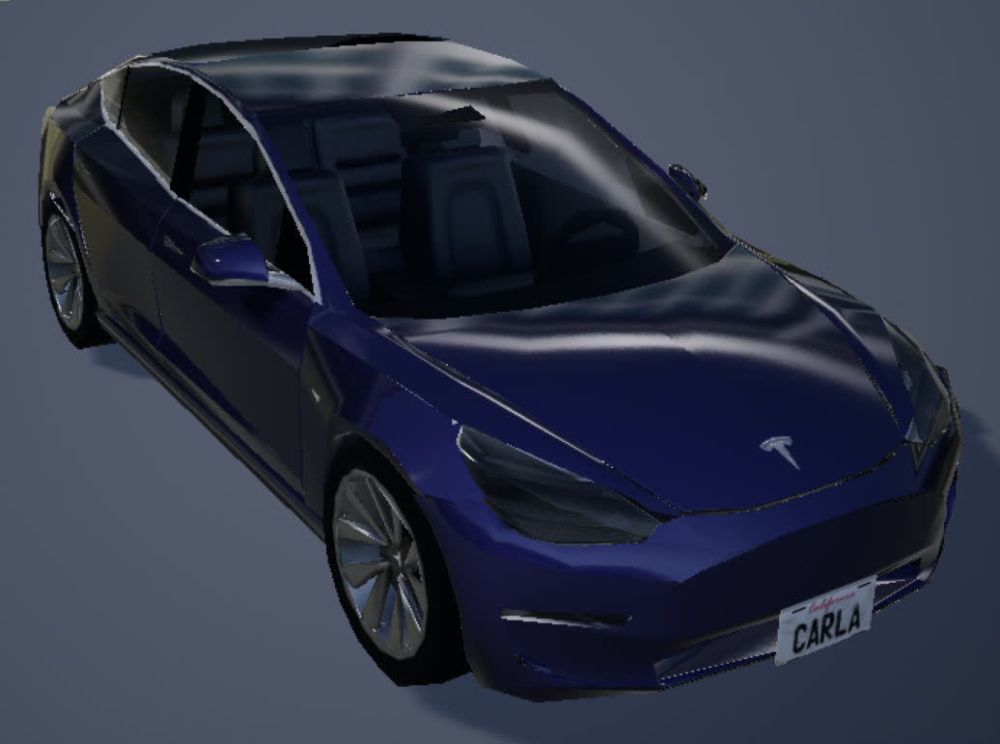 | 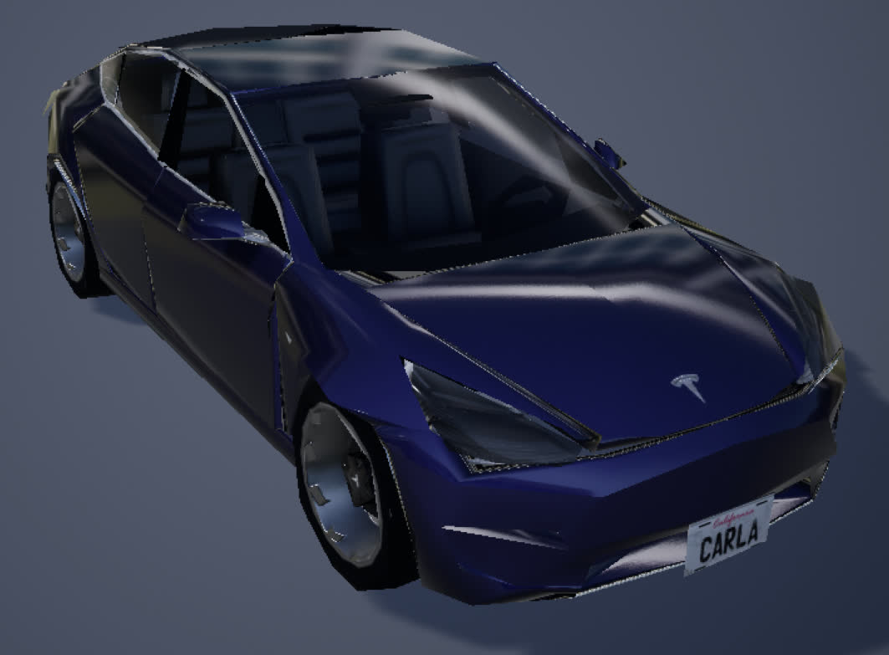 | 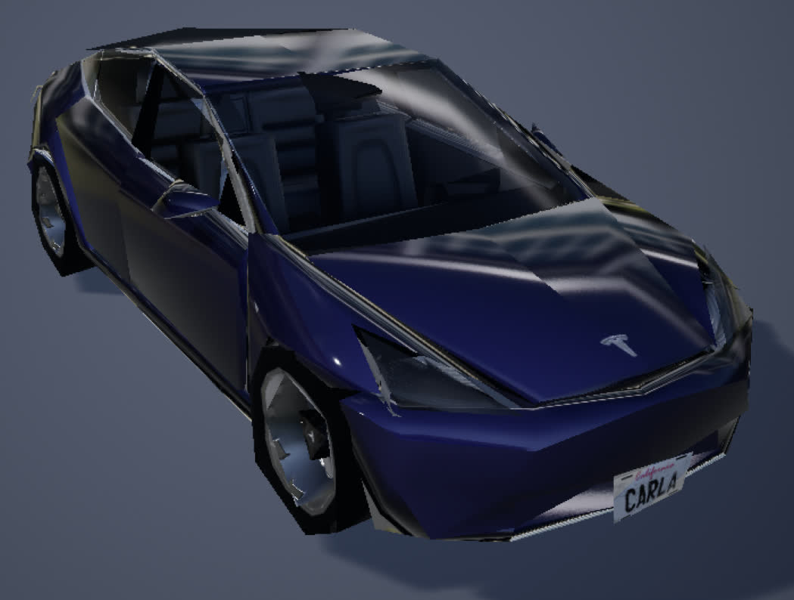 |

## Okay so what?
While the default LOD settings are pretty good in Carla, this works because **Carla was not designed for VR** and expects to be run on a flat screen. However, we are using Carla in a VR setting, and it quickly becomes much more pronounced when models transform into lower/higher quality forms. This can be very distracting and immersion-breaking for the person in the headset. 

### Download pre-compiled meshes
If you aren't interested in following the steps on creating your own LODSettings asset and bulk-applying it, skip everything until the **Download Everything Instead** step, else read on. 

## How to fix?
The best "fix" here would be to change the distance thresholds so that the transformations would be much more aggressive and stay in higher-quality for longer. This increase in quality comes at a cost of performance of course. 

One possible workaround we found (which did not work for us unfortunately) was [this comment](https://github.com/carla-simulator/carla/issues/276#issuecomment-374541267) by a Carla contributor who elaborated that "the popping in the vegetation and other models is caused by the Level of Detail. We have various versions of the same model with different polygonal levels to replace the final model depending on the distance from the camera. Ideally, these changes would be imperceptible but more tweaking would be needed to reach that ideal point. You can force the highest LoD on everything by typing `r.forcelod 1` and `foliage.ForceLOD 1` in the Unreal Engine console". Similarly, there is further work to look into texture MipMapping (similar idea but for textures) which uses UE4's TextureStreaming. For this guide we'll mostly focus on changing just the LOD settings of the main vehicles. 

### Important:
Technically, the logic behind LOD picking is not based on "distances from the camera" as is commonly described, but rather by the "screen space" that is being taken up by the model. This is best explained in the [UE4 documentation on LOD Screen Size](https://docs.unrealengine.com/4.26/en-US/WorkingWithContent/Types/StaticMeshes/HowTo/PerPlatformLODScreenSize/) (ignore the per-platform overrides, everything we're doing is on the a desktop client) where they mention "to control when one Level Of Detail (LOD) Static Mesh transitions into another one, Unreal Engine 4 (UE4) uses the current size of the Static Meshes size in Screen Space".

## Deep dive into UE4
In order to actually access the LOD's for every blueprint, we're actually going to need to take a step back and look towards the [`SkeletalMesh`](https://docs.unrealengine.com/4.26/en-US/WorkingWithContent/Types/SkeletalMeshes/) of the model rather than the blueprint itself. The skeletal mesh is in-between the `StaticMesh` and the final blueprint since it contains all the animations/rigging/physics/etc. that a static mesh does not, but does not contain any of the control logic for a usable actor. 

For example, for the `SM_TeslaM3_v2` skeletal mesh (note there is also a `SM_Tesla` static mesh, the naming scheme is unfortunately not very consistent), head over to `Content/Carla/Static/Vehicles/4Wheeled/Tesla/` in the Content Browser to see the following folder layout: 

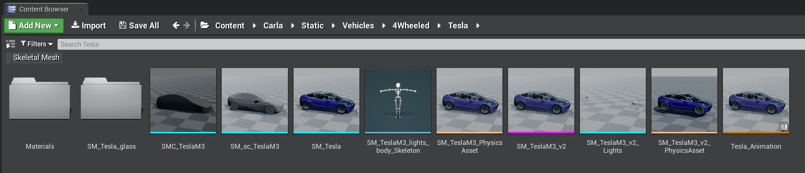

Notice how the model underlined in **pink** is the skeletal mesh we are interested in. Double click it to open it in the Editor. 

Then, in the left, in the `Asset Details` pane (highlighted below in **red**) you can see the LOD Picker settings is currently set to Auto (LOD0) this will automatically compute and assign the LOD for this mesh based on your distance. You can see the current LOD settings in action in the top left of the preview window (highlighted below in **yellow**).

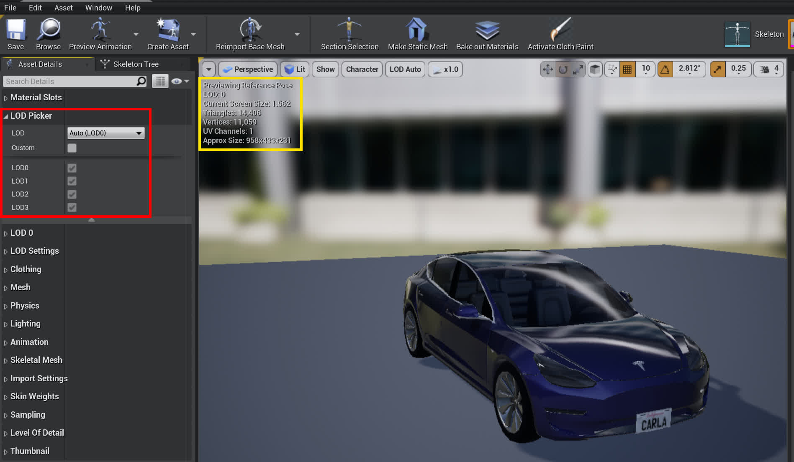

From the LOD picker you could check the `"Custom"` box and edit the individual LOD settings manually, but this is a lot of tedious work that would need to be applied to **every** static mesh individually. In this guide we'll try to avoid tedious work. 

## There has to be a better way?
Yes, in fact, there is! ([More documentation](https://docs.unrealengine.com/4.26/en-US/AnimatingObjects/SkeletalMeshAnimation/Persona/MeshDetails/))

Under the LOD Picker in Asset Details you might notice the `LOD Settings` section. Open it up and focus on the LODSettings input (currently empty "None"). This means there exists a `.uasset` asset that we can create to generalize LOD settings for all vehicles. We just need to apply this LODSetting asset to each of them once beforehand. 

If you don't have an existing LODSettings asset (we've provided one in [`Tools/LOD/SM_Vehicle_LODSettings.uasset`](Tools/LOD/SM_Vehicle_LODSettings.uasset)) you can create one with the `Generate Asset` button. We moved ours to a new `4Wheeled/DReyeVR/` directory. Then in LODSettings, select the drop-down menu and choose the newly created LODSetting. 

| LODSettings pre application                    | LODSettings post application                    |
| ---------------------------------------------- | ----------------------------------------------- |
| 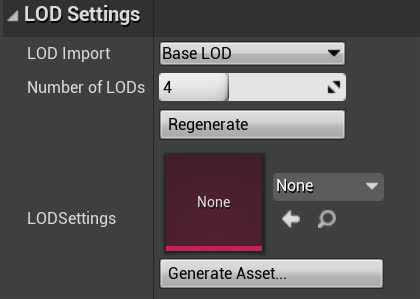 | 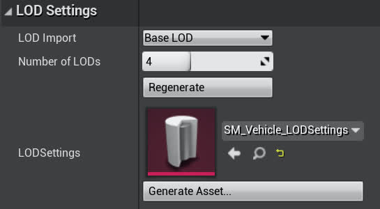 |

Now you should be able to open up the newly created `LODSettings` asset (`SM_Vehicle_LODSettings`) in the editor and edit all the important LOD parameters from there. Here is where the fine-tuning for screen-size takes place as you can manually tune when transitions happen. 
### NOTE
Something to keep in mind is that different vehicles even have different number of LOD's, some (like `SM_TeslaM3_v2` have 4) have more or less than others. So in order to have a singular LODSetting apply for everyone, we'll need to make sure its array is as large as the largest LOD for all requested meshes. Since there should not really be a limit to this, we used an array of size 7 (not all vehicles need to access all 7) for some leg-room (no array-OOB exceptions). 

| LOD | Default (`SM_TeslaM3_v2`) Screen Size | New LODSettings Screen Size |
| --- | ------------------------------------- | --------------------------- |
| 0   | 2.0                                   | 1.0 (max)                   |
| 1   | 0.4                                   | 0.2                         |
| 2   | 0.21                                  | 0.05                        |
| 3   | 0.12                                  | 0.03                        |
| 4   | N/A                                   | 0.01                        |
| 5   | N/A                                   | 0.005                       |
| 6   | N/A                                   | 0.001                       |

This should look something like the following (with LODGroups collapsed):

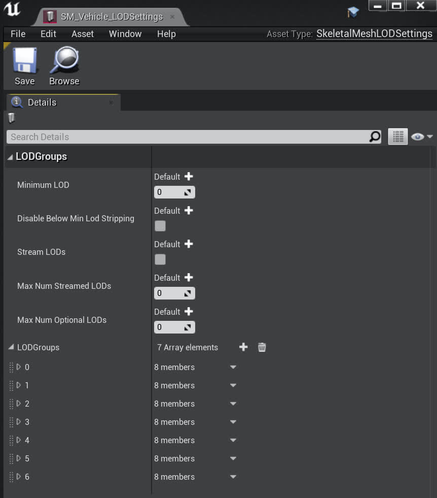

Theoretically we should be able to have this class completely in C++ since it is a [`USkeletalMeshLODSettings`](https://docs.unrealengine.com/4.26/en-US/API/Runtime/Engine/Engine/USkeletalMeshLODSettings/) class. But it is fairly low on the priority list. 

## Okay now what?
Now we can edit our `SM_Vehicle_LODSettings.uasset` file and all the LOD settings for our `SM_TeslaM3_v2` should respect it. This is great! 
- Note sometimes the mesh will use cached LOD's to force regeneration click the `Regenerate` button in the `SM_TeslaM3_v2` editor window in `LODSettings`. This shouldn't be a problem on the next `make launch` of the editor.

Now it would be great to apply this `SM_Vehicle_LODSettings.uasset` to all the static meshes at once right? Turns out we can do this with a [bulk-edit-via-property-matrix](https://docs.unrealengine.com/4.26/en-US/Basics/UI/PropertyMatrix/)

The steps we recommend are as follows:
1. Go to the `4Wheeled/` directory in the content browser
2. In the bottom right (View Options) uncheck the `Folders` option
3. In the top left click the `Filters` and check the `SkeletalMesh` option
   - Now you should see this (notice all pink underlined):
	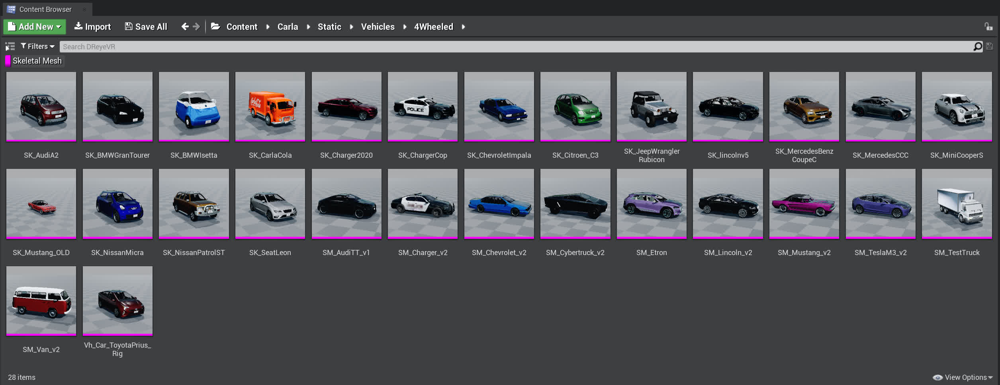
4. Now select all the meshes **EXCEPT for the following** 
	- Windows:
       1. SM_Cybertruck_v2
       2. SM_ETron
	- Linux:
       1. SK_Charger2020
       2. SK_ChargetCop
       3. SK_lincolnv5
       4. SK_MercedesCCC
	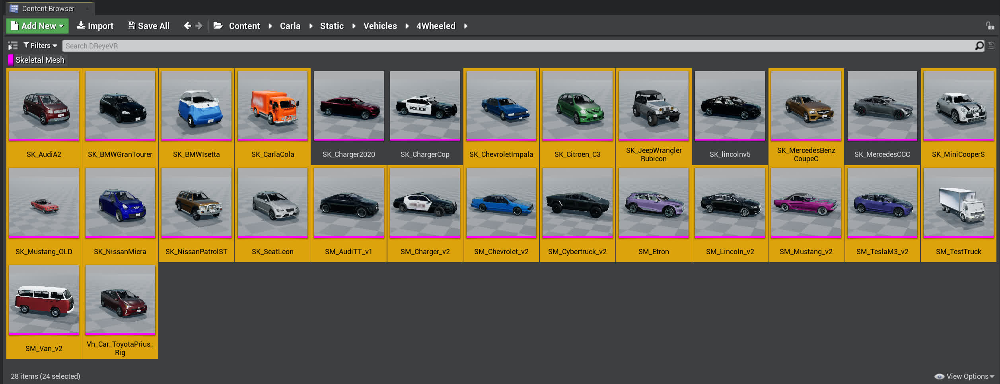
	- We are still unsure why, but these particular vehicles cause a segmentation fault (something to do with their vertex makeup) upon this application. You will need to manually set the LOD parameters for individual custom LOD's for each of them (ie. do NOT use the `SM_Vehicle_LODSettings.uasset` at all)
5. Right click any of the highlighted vehicles -> `Asset Actions` -> `Bulk Edit via Property Matrix`
	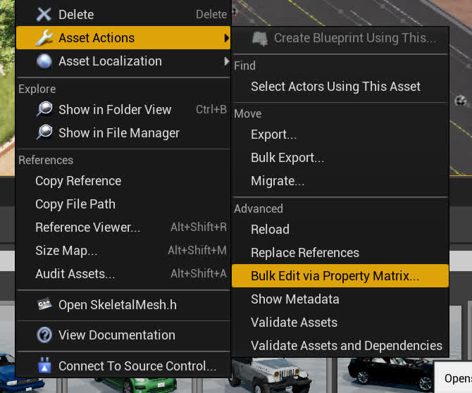
6. In the `Bulk Edit` window that opens up, verify all the correct skeletal meshes on the left, then in `LODSettings` on the right, click the 3x3 grid icon (Pick asset) and choose the newly created `SM_Vehicle_LODSettings.uasset` asset. 
   1. To apply this to all the selected skeletal meshes, go to the top bar -> `File` -> `Save`
   2. The end result should look something like this:
	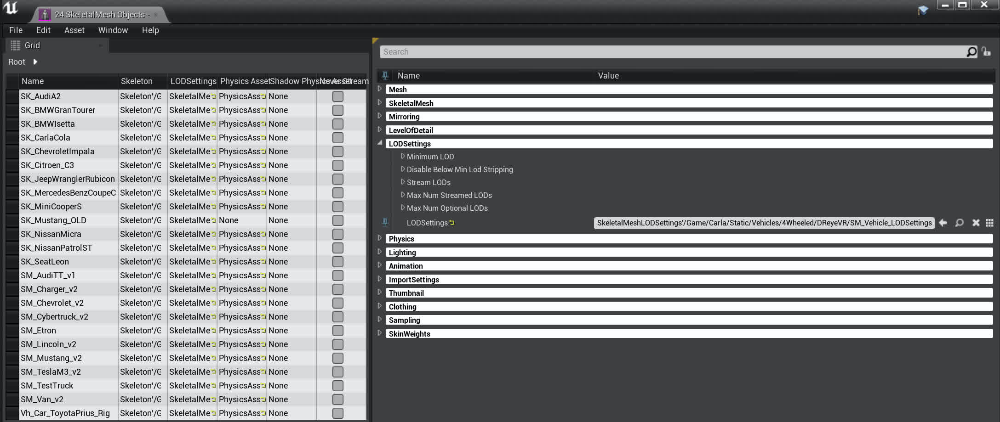

As mentioned in step 4, some particular vehicles cause a seg-fault after giving them this `LODSettings`. We are still investigating why exactly but for now its safer to just manually go into each vehicle and tune the individual `LOD` settings after checking `Custom` and seeing the `LOD0`, `LOD1`, `LOD2`, ... etc. options. 

## Finished
Now, all the static meshes (with some exceptions) will respect any changes made to `SM_Vehicle_LODSettings.uasset` automatically, so you won't have to reapply the settings each time you want to make a change to the LODSettings asset, just make the change.

Also, if something unfortunate happens and one of your skeletal meshes gets corrupted (its happened to us), then its fairly simple to reclone a `Carla 0.9.13` build, run the `Update.sh` script and copy over the old (new) static meshes to replace the ones in your existing project. 

## Download everything instead
Option 1: (use our script)
```bash
cd DReyeVR/Tools/LOD/
# installing on Linux
./install_LOD.sh /PATH/TO/CARLA Linux
# installing on Windows
./install_LOD.sh /PATH/TO/CARLA Windows
# installing Original (reset all changes)
./install_LOD.sh /PATH/TO/CARLA Original
```
Option 2: (manually)
- Follow these simple steps:
  1. Download all the static meshes from this link ([Linux](https://drive.google.com/file/d/1OqDOCAflENnXvbJCogBEmRhHQpEF1aKE/view) or [Windows](https://drive.google.com/file/d/191tiK25MJ9C7-5Q1-sHt1mp4_EaefjqM/view)) 
  2. Extract all files 
  3. Copy files to the following directories

These are the important skeleton meshes and directories
```bash
Unreal/CarlaUE4/Content/Carla/Static/Vehicles/4Wheeled/Toyota_Prius/Vh_Car_ToyotaPrius_Rig.uasset
Unreal/CarlaUE4/Content/Carla/Static/Vehicles/4Wheeled/AudiA2_/SK_AudiA2.uasset
Unreal/CarlaUE4/Content/Carla/Static/Vehicles/4Wheeled/BmwGranTourer/SK_BMWGranTourer.uasset
Unreal/CarlaUE4/Content/Carla/Static/Vehicles/4Wheeled/BmwIsetta/SK_BMWIsetta.uasset
Unreal/CarlaUE4/Content/Carla/Static/Vehicles/4Wheeled/CarlaCola/SK_CarlaCola.uasset
Unreal/CarlaUE4/Content/Carla/Static/Vehicles/4Wheeled/DodgeCharger2020/SK_Charger2020.uasset
Unreal/CarlaUE4/Content/Carla/Static/Vehicles/4Wheeled/DodgeCharger2020/ChargerCop/SK_ChargerCop.uasset
Unreal/CarlaUE4/Content/Carla/Static/Vehicles/4Wheeled/Chevrolet/SK_ChevroletImpala.uasset
Unreal/CarlaUE4/Content/Carla/Static/Vehicles/4Wheeled/Citroen/SK_Citroen_C3.uasset
Unreal/CarlaUE4/Content/Carla/Static/Vehicles/4Wheeled/Jeep/SK_JeepWranglerRubicon.uasset
Unreal/CarlaUE4/Content/Carla/Static/Vehicles/4Wheeled/LincolnMKZ2020/SK_lincolnv5.uasset
Unreal/CarlaUE4/Content/Carla/Static/Vehicles/4Wheeled/Mercedes/SK_MercedesBenzCoupeC.uasset
Unreal/CarlaUE4/Content/Carla/Static/Vehicles/4Wheeled/MercedesCCC/SK_MercedesCCC.uasset
Unreal/CarlaUE4/Content/Carla/Static/Vehicles/4Wheeled/MIni/SK_MiniCooperS.uasset
Unreal/CarlaUE4/Content/Carla/Static/Vehicles/4Wheeled/Mustang/SK_Mustang_OLD.uasset
Unreal/CarlaUE4/Content/Carla/Static/Vehicles/4Wheeled/Nissan_Micra/SK_NissanMicra.uasset
Unreal/CarlaUE4/Content/Carla/Static/Vehicles/4Wheeled/Nissan_Patrol/SK_NissanPatrolST.uasset
Unreal/CarlaUE4/Content/Carla/Static/Vehicles/4Wheeled/Leon/SK_SeatLeon.uasset
Unreal/CarlaUE4/Content/Carla/Static/Vehicles/4Wheeled/AudiTT/SM_AudiTT_v1.uasset
Unreal/CarlaUE4/Content/Carla/Static/Vehicles/4Wheeled/DodgeCharge/SM_Charger_v2.uasset
Unreal/CarlaUE4/Content/Carla/Static/Vehicles/4Wheeled/Chevrolet/SM_Chevrolet_v2.uasset
Unreal/CarlaUE4/Content/Carla/Static/Vehicles/4Wheeled/Cybertruck/SM_Cybertruck_v2.uasset
Unreal/CarlaUE4/Content/Carla/Static/Vehicles/4Wheeled/AudiETron/SM_Etron.uasset
Unreal/CarlaUE4/Content/Carla/Static/Vehicles/4Wheeled/LincolnMKZ2017/SM_Lincoln_v2.uasset
Unreal/CarlaUE4/Content/Carla/Static/Vehicles/4Wheeled/Mustang/SM_Mustang_v2.uasset
Unreal/CarlaUE4/Content/Carla/Static/Vehicles/4Wheeled/Tesla/SM_TeslaM3_v2.uasset
Unreal/CarlaUE4/Content/Carla/Static/Vehicles/4Wheeled/Truck/SM_TestTruck.uasset
Unreal/CarlaUE4/Content/Carla/Static/Vehicles/4Wheeled/VolkswagenT2/SM_Van_v2.uasset
```

### NOTE: Sometimes there are still segfaults with these LOD's on different machines. 
For example, the `SM_Cybertruck_v2` and `SM_Etron` skeletal meshes cause seg-faults on Windows, but not on Linux. 
- In order to check which ones cause the segfault, open all the skeletal meshes in `4Wheeled` one by one (or select them all) and replace them with the original skeleton meshes. 
- Note, we've provided the original models [here](https://drive.google.com/file/d/1Vc4e43xZuXOJF_3-r3n3QU-yE5sjiAfw/view) which you can use to replace any broken skeletons
  - But ideally our Windows/Linux downloads should work on those platforms. Summary of broken skeleton mesh:
    - Windows:
      - SM_Cybertruck_v2
      - SM_Etron
    - Linux:
      - SK_Charger2020
      - SK_ChargerCop
      - SK_lincolnv5
      - SK_MercedesCCC
