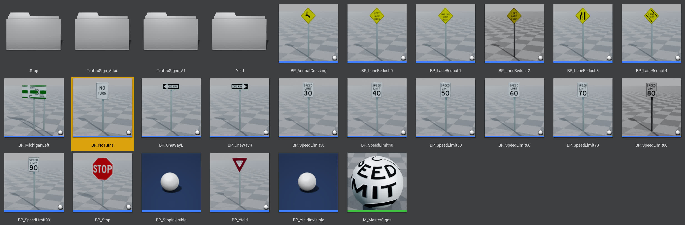
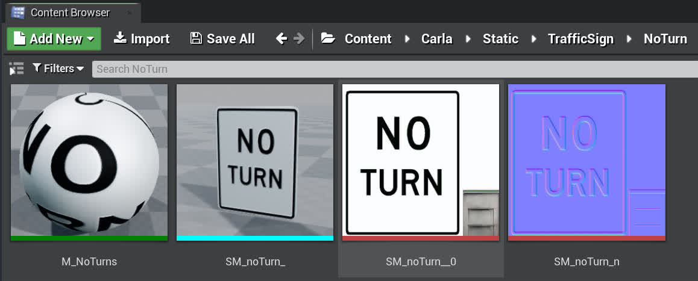
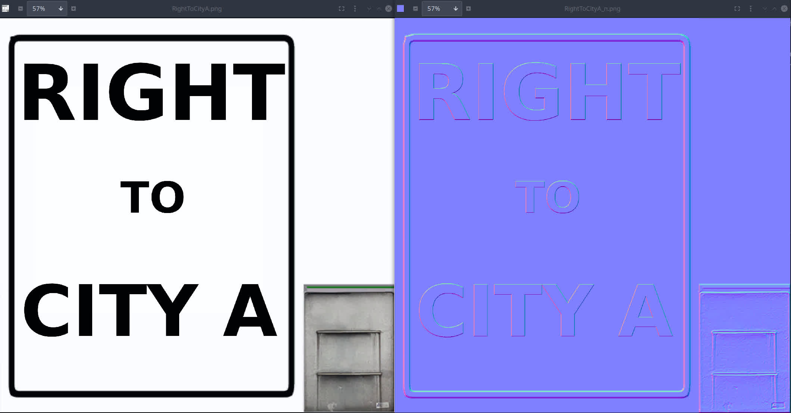
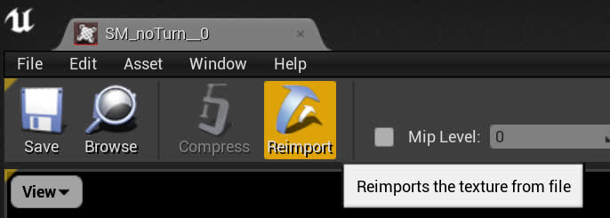
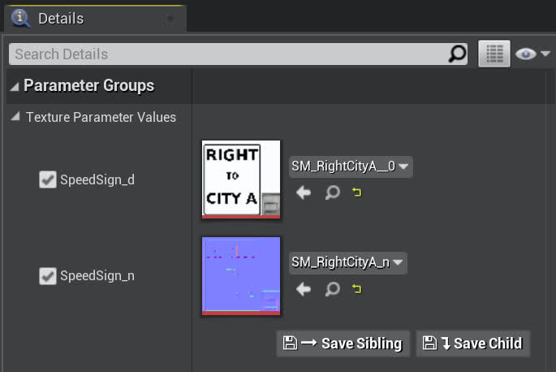
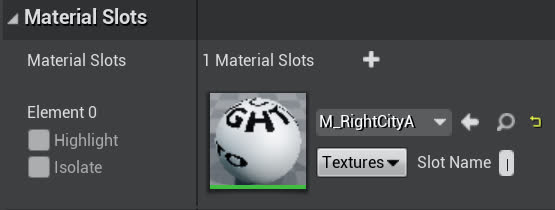
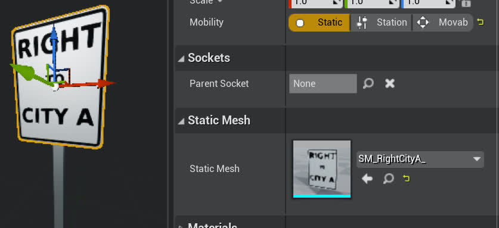
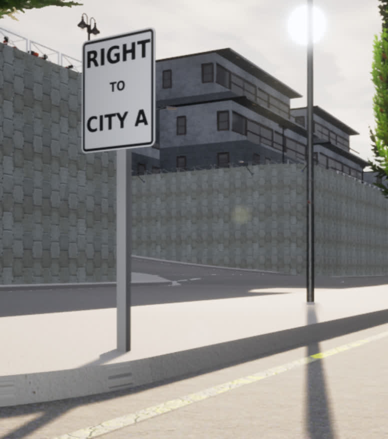
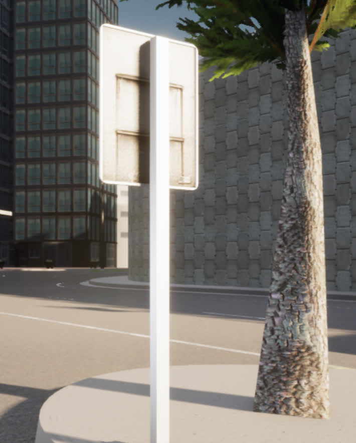

# Adding custom signs in the Carla world

## What is this?
It is often useful to have participants in an experiment know what directions to take in a natural manner without manual intervention. In Carla this is not a problem since all the drivers are AI controllers, but for humans we can't simply ingest a text file denoting waypoints and directions. This is where in-environment directional signs can be of use. Unfortunately, Carla does not provide any (since this is not a problem for them) and there were enough steps to warrant a guide, so here you go. 

This guide will show you how to create your own custom signs and place them in any Carla level (*Technically, the guide can work to add any custom props in Carla, not just signs*)
- The steps are as follows:
  1. Create the sign textures (rgb/normals)
  2. Create the sign mesh/material
  3. Apply the materials onto a blueprint
  4. Manually place the blueprint into the world
  5. **Optional:** Register the new sign with the blueprint library

## Getting started
Sign textures can be found in Carla in the `carla/Unreal/CarlaUE4/Content/Carla/Static/TrafficSign/` directory. 

For example, you should see a directory that looks like this:



Notice how all the models have a corresponding directory (some are cut off in the screenshot). These are where the static meshes and textures are defined so they can be used on these sign-shaped blueprints. 

- For the rest of this guide, we'll focus on using the `NoTurn` directory that looks like this when opened in the content browser:


- From left to right these are the **Material Instance** (`M_` prefix), **Static Mesh** (`SM_` prefix), **Texture RGB** (`__0` suffix), and **Texture Normals** (`_n` suffix)

## Step 1: Creating the sign textures
The "NO TURN" sign serves as a good baseline for creating our custom signs, though any signs can be used as a starting point. 

Now, you can screenshot the image (or find its source file in Details->File Path) to get a `.jpg` of the desired texture, then clear out the original text ("NO TURN") so it is a blank canvas. For your convenience we have a blank "NO TURN" sign already provided in [`Content/Static/DefaultSign.jpg`](../../Content/Static/DefaultSign.jpg)
- Notice how the bottom right corner of these images has is a small gray-ish region. This is actually for the rear of the sign so that when it is applied on to the models, the rear has this metallic surface. 
  - This means we want to do most of our sign content editing in the region within the black perimeter

It is useful to have a powerful image editing tool for this, we used [GIMP](https://www.gimp.org/) (free & open source) and the rest of this section will reference it as the image editing tool.

From within Gimp you should be able to add whatever static components you like (text, images, etc.) within the designated region. Once you are finished with your new sign image, export it as a `.jpg`.

Next, you'll want GIMP to create the normals map for you. This can be done easily by going through `Filters -> Generic -> Normal Map` and applying the default normal generation to the newly created image. Export this file with the suffix `_n.jpg` to indicate that it is the normal map.

For example, if we wanted our sign to say "RIGHT TO CITY A", then after this process you should see something that looks like this:



Now we are done with image manipulation and using GIMP. 

Now back in UE4, it'll be easiest if you duplicate the `TrafficSign/NoTurn/` directory into your custom directory (such as `DReyeVR_Signs/` with all the same 4 elements (material, static mesh, texture RGB, and texture normals)).
- Note: there are some reports of users not being able to copy/paste/duplicate directly in the editor. In this case, just do so in your file manager and reopen the editor again.
  - ```bash
	cd $CARLA_ROOT/Unreal/CarlaUE4/Content/Carla/Static/TrafficSign/
	cp -r NoTurn/ RightCityA/
    ```
  - ```bash
	# now RightCityA contains the following
	RightCityA
	- M_NoTurns.uasset
	- SM_noTurn.uasset
	- SM_noTurn_n.uasset
	- SM_noTurn_.uasset
    ``` 

|                                                                                                                                                                                                                                                                              |                                                                    |
| ---------------------------------------------------------------------------------------------------------------------------------------------------------------------------------------------------------------------------------------------------------------------------- | ------------------------------------------------------------------ |
| Now, in your new custom directory, you can easily reimport a new `.jpg` source file by clicking the `Reimport` button at the top. </br> </br> Locate your rgb `.jpg` image for the `SM_noTurn` reimport, and use the normals `.jpg` image for the `SM_noTurn_n` reimport. |  |

Feel free to rename the `SM_noTurn_*` asset files **within the editor** (right click in content browser -> rename) and keep the naming scheme. Something like `SM_RightCityA` and `SM_RightCityA_n`.

## Step 2: Creating the sign meshes & materials
Now, you should make sure that the **Material** (`M_noTurns`) asset file is updated with the new textures. This may occur automatically, but just in case you should open it up in the editor and select the newly created `SM_RightCityA` and `SM_RightCityA_n` as the Texture parameter values for `SpeedSign_d` and `SpeedSign_n` respectively.
- To do this, click the dropdown menu box which say `SM_noTurn` and `SM_noTurn_n` and search for the new `RightCityA` variants
- The parameters should then look something like this
	

Save it and rename it (**in the editor**) as well: `M_RightCityA` should suffice.

Now, finally open up the `SM_noTurn_` (static mesh) asset file and ensure it uses our newly created `M_RightCityA` material by editing the Material element in the Material Slots:
- Similarly to before, this is done in the Details pane by clicking the dropdown, searching for "RightCity", and selecting our new material
	

Save it and rename it (always **in the editor**): `SM_RightCityA_` works.

At this point you should have a `RightCityA` directory that looks like the following:


## Step 3: Applying the new materials onto a blueprint

Once all the desired materials/static meshes are ready, duplicate a sign blueprint (from the parent `TrafficSign` directory) and place it in `RightCityA`
- This should be doable from within the editor. Right click `BP_NoTurns` -> Duplicate -> Enter new name -> Drag to `RightCityA/` -> select move

Open up the blueprint to the `Viewport` tab and select the sign component (not the pole)

In the Details pane you should again see a `Static Mesh` component that is still the `SM_noTurn_`, replace that with out new `SM_RightCityA_` asset, Recompile & Save, and you should be done. 

Now it should look like this: 



## Step 4: Placing the new sign in the world

With our new sign blueprint, we can place it into the world fairly easily. Simply drag and drop it into the world, then edit its transform, rotation, and scale parameters to fine tune the result. 

The end result should look pretty decent, here's an example of our new sign in `Town03`

| Front of the sign                           | Rear of the sign                          |
| ------------------------------------------- | ----------------------------------------- |
|  |  |

Notice how both the front and rear look good, this is because the rear is given the metallic region from the bottom-right of the texture. 

## Step 5: (Optional) Registering with the BP library

Registering our new sign with Carla's blueprint library allows us to spawn the sign from the PythonAPI and hence allows for dynamic placement at runtime. 

This is slightly more in-depth than the existing Carla signs since they were not designed to be spawned dynamically, rather they were placed into the world statically at compile-time. This becomes frustrating if we'd like to place different signs around the map for various scenarios without recompiling everything again. 

As per [this issue](https://github.com/carla-simulator/carla/issues/4363), the usual way of using custom props on Carla 0.9.11 is currently broken and unreliable. We found a [workaround](https://github.com/carla-simulator/carla/issues/4363#issuecomment-924140532) and included it in the issue. 

Essentially you'll need to edit the `carla/Unreal/CarlaUE4/Content/Carla/Config/Default.Package.json` file to include your new sign prop as follows:

```json
	{
		"name": "YOUR_SIGN_NAME",
		"path": "/PATH/TO/YOUR/SM_SIGN.SM_SIGN",
		"size": "Medium"
	}
```
Note that the `"path"` source is looking for a UE4 static mesh object, which will be stored as a `.uasset` file. Still denote it as `SM_name.SM_name` in the `json`. 

Importantly, if you want to include a custom prop directory in `Content/` (instead of using our `DReyeVR/DReyeVR_Signs/` content) you should add this to the list of cooked assets in `Config/DefaultGame.ini` such as:

```ini
+DirectoriesToAlwaysCook=(Path="/Game/DReyeVR/DReyeVR_Signs") # what we include
+DirectoriesToAlwaysCook=(Path="/Game/YOUR_PROP_DIR/") # any desired prop directory
```
This ensures your custom props are properly cooked during shipping (`make package`). 

Once this change is imported in the map you will be able to spawn your sign as follows:
```python
bp = blueprint_library.filter(("static.prop.YOUR_SIGN_NAME").lower()) # filter is lowercase!
assert len(bp) == 1 # you should only have one prop of this name
transform = world.get_map().get_spawn_points()[0] # or choose any other spawn point
world.spawn_actor(bp[0], transform) # should succeed with no errors
```

**NOTE** In constructing our (and Carla's) signs, we unlink the sign itself from the pole it connects to. Therefore, if you want to spawn the sign *with* the pole you'll need to combine these static meshes. 
- This is supported within the editor by placing both actors into the world, selecting both, then using the Window -> Developer -> MergeActors button as described in [this guide](https://docs.unrealengine.com/4.27/en-US/Basics/Actors/Merging/). 
- We have already provided a baseline with the [`Content/DReyeVR_Signs/FullSign/`](Content/DReyeVR_Signs/FullSign/) directory where we combined the signs with the poles as a single static mesh. 
	- With this baseline, assuming you have a compatible material (using the same sign template as ours) you can just update the material for the sign component without further modification. 


# Automatic Sign Placement
When using our [scenario-runner fork](https://github.com/HARPLab/scenario_runner/tree/DReyeVR-0.9.13), there is logic to enable spawning the corresponding directional signs automatically according to the route features (straight, turn left, turn right, and goal). The logic for this can be found in the [route_scenario's nav sign code](https://github.com/HARPLab/scenario_runner/blob/3b5e60f15fd97de00332f80610051f9f39d7db8c/srunner/scenarios/route_scenario.py#L284-L355). Since this is automatically applied to all routes, you can disable it manually by commenting the `self._setup_nav_signs(self.route)` method call.

There is also a file method in case you want to manually place signs for specific routes (see [here](https://github.com/HARPLab/scenario_runner/blob/DReyeVR-0.9.13/srunner/data/all_routes_signs.json)), but we found that the automatic sign placement works fine most of the time and is much more convenient. So the automatic method is recommended and you don't have to do anything to enable it.