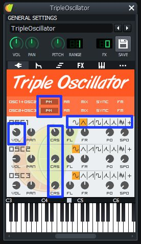
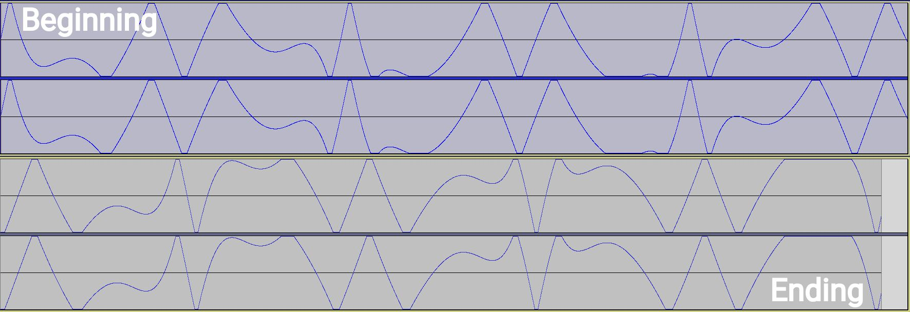
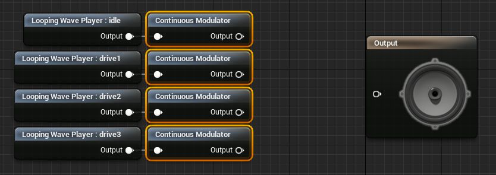
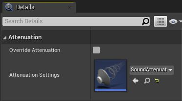
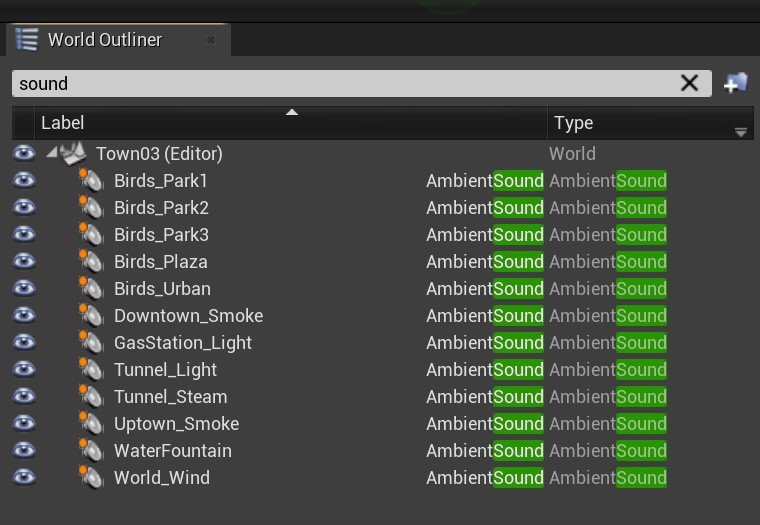
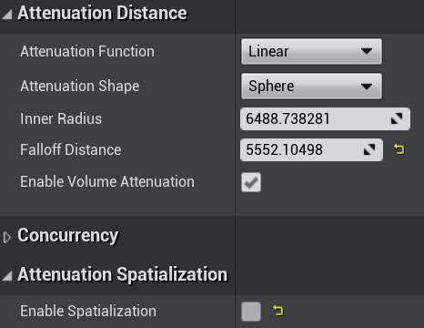
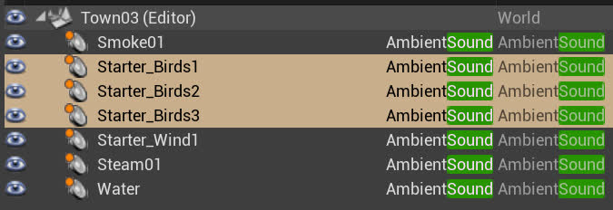
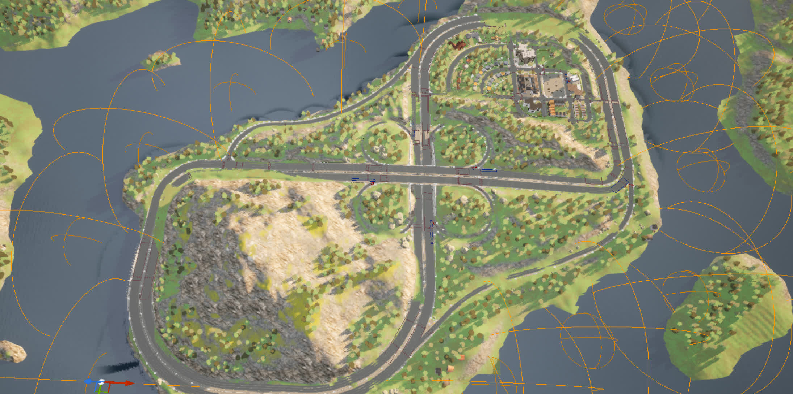

# Adding and using sound in Carla+`DReyeVR`

One of the first things you might notice when trying out `Carla` (all versions) is that there is absolutely no sound in the simulator. However, for our purposes, we are striving for an immersive experience with lots of feedback to a user about the world, and sound is a great way to add that. 

In this doc we'll go over how we added sound of the following:
1. Vehicle engine revving
2. Other vehicle sounds (gears/turn signals)
3. Ambient world noise 
4. Acknowledgements

## Engine revving
One of the best feedback mechanisms for a user applying throttle is the roar of an engine as the RPM increases. 
- Yes, we know, we're using a Tesla model for our ego-vehicle but giving it engine/gear noises... blasphemy!

[**CREDITS**]Most of this section comes from this [very helpful guide on youtube](https://www.youtube.com/watch?v=-c-f1aaIOnU) which is also available in [written form as an article](https://continuebreak.com/articles/generating-setting-basic-engine-sounds-ue4-part-12/). We highly recommend taking a look at it to get step-by-step instructions and visuals for the following steps.
### Creating the sounds
(skip this step if you already have desired sound files for your engine)
1. Download requisite software:
   - [LMMS](https://lmms.io/) (download for [Linux](https://lmms.io/download#linux)/[Windows](https://lmms.io/download#windows)/[Mac](https://lmms.io/download#mac)) for creating music tracks
2. Create 4 sounds, these correspond to when the engine is idle (1), running slowly (2), running normally (3), and running at max RPM (4)
   - For all these tracks, we'll start with a sole TripleOscillator playing a constant C2 octave (4 beats should be fine). 
      | Configuration                                                                                                                                                                                                                                                                                                | Visually                                                  |
      | ------------------------------------------------------------------------------------------------------------------------------------------------------------------------------------------------------------------------------------------------------------------------------------------------------------ | --------------------------------------------------------- |
      | PM value for OSC1+OSC2   PM value for OSC2+OSC3   OSC1 volume of 60  OSC1 CRS of -4  OSC1 to use triangle wave   OSC2 CRS of -24   OSC3 CRS of -24    Image credits: [ContinueBreak](https://continuebreak.com/articles/generating-setting-basic-engine-sounds-ue4-part-12/) |  |
   - Then we'll want to amplify this effect by adding an LMMS-type Amplifier from the FX-Mixer window and crank the volume to the max.
   1. This works for the idle engine sound, nothing more to do here. The remaining drive sounds will gradually increase their CRS values.
   2. For Drive1 change OSC1 CRS to 0, OSC2 CRS to -20, OSC3 CRS to -20.
   3. For Drive2 change OSC1 CRS to 2, OSC2 CRS to -18, OSC3 CRS to -18.
   4. For Drive3 change OSC1 CRS to 2, OSC2 CRS to -16, OSC3 CRS to -16.
   - Feel free to tune the sounds however you'd like, these are the recommended numbers from the [guide mentioned earlier](https://continuebreak.com/articles/generating-setting-basic-engine-sounds-ue4-part-12/)
3. Export all the sounds as `.wav` and make sure to enable the "Export as loop" to remove end silence.

### Looping the sounds in Audacity
(skip this step if your tracks already loop without discontinuities)
1. Download requisite software
   - [Audacity](https://www.audacityteam.org/) (download for [Linux](https://www.audacityteam.org/download/linux/)/[Windows](https://www.audacityteam.org/download/windows/)/[Mac](https://www.audacityteam.org/download/mac/)) for editing the audio tracks in post (ensure looping)
2. Import each sound track individually to Audacity (we'll do this one-at-a-time)
   1. When looping, you'll probably hear a sudden snap/click sound on every repeat, this is due to wave discontinuities
3. We'll want to find where the sound starts/ends and make sure the wave approximately matches so as to have a continuous transition between repetitions.
   1. This can be done by finding patterns from the beginning and cutting off the minimum amount from the track such that a new pattern would fit in as soon as the track ended.

Image source: [ContinueBreak](https://continuebreak.com/articles/generating-setting-basic-engine-sounds-ue4-part-12/)
1. After you cut all the tracks to be seamlessly loopable, export them to new `.wav`'s and these are ready to be taken in to the UE4 and used as vehicle noises.
### Applying the sounds in UE4
1. With all the desired tracks at our disposal, we'll import them all to the engine (big Import button in content-browser)
2. Create a **SoundCue** asset (right-click in content browser -> Sounds -> SoundCue)
   1. Open the SoundCue blueprint asset in the editor (opens new window)
      1. Import all tracks to the blueprint, and check the **"Looping"** checkbox
   2. Attach a **Continuous Modulator** node to each output from the Looping Wave Player's
      1. The parameters for these Continuous Modulators define the range of input/output for these tracks (value min/max)
      2. **NOTE** all the params have the same name `"RPM"` it is very important this is consistent as it will be used in the `C++` code
      
         - Image credits: [ContinueBreak](https://continuebreak.com/articles/generating-setting-basic-engine-sounds-ue4-part-12/)

      - These are the recommended parameter values from the guide.
         | Parameter  | Idle     | Drive1   | Drive2   | Drive3   |
         | ---------- | -------- | -------- | -------- | -------- |
         | Name       | RPM      | RPM      | RPM      | RPM      |
         | Default    | 1        | 1        | 1        | 1        |
         | Min Input  | 0        | 20       | 500      | 2200     |
         | Max Input  | 200      | 600      | 2800     | 5700     |
         | Min Output | 0.65     | 0.8      | 1.25     | 1.9      |
         | Max Output | 1.1      | 1.0      | 1.25     | 1.9      |
         | Param Mode | Absolute | Absolute | Absolute | Absolute |
   3. Add a **Crossfade by Param** with 4 parameters to handle the input/output transitions
      1. The parameters for these Continuous Modulators define how transitions are dealt with (fade in/out for each track)
         - These are the recommended parameter values from the guide
            | Parameter                | Idle | Drive1 | Drive2 | Drive3 |
            | ------------------------ | ---- | ------ | ------ | ------ |
            | Fade In RPM Value Start  | 0    | 150    | 550    | 2290   |
            | Fade In RPM Value End    | 0    | 350    | 750    | 2340   |
            | Fade Out RPM Value Start | 200  | 600    | 2300   | 5800   |
            | Fade Out RPM Value End   | 400  | 800    | 2350   | 5800   |
            | Volume                   | 1.0  | 0.6    | 0.6    | 0.6    |
3. Finally, you'll likely want some sort of attenuation device to fade out the noise of far away objects
   1. Create a **Sound Attenuation** asset (right-click in content browser -> Sounds -> SoundAttenuation)
      1. Change the **Inner Radius** to 1500
      2. Change the **Falloff Distance** 3000
   2. Back in the **Sound Cue** asset from step 2, scroll down in the Details pane and use the newly created **Sound Attenuation** asset as its Attenuation Settings:
   
      
         - Image credits: [ContinueBreak](https://continuebreak.com/articles/generating-setting-basic-engine-sounds-ue4-part-12/)

## Other vehicle noises
Generally, adding sounds can get complicated like the above, or they can be very simple for something quick.
- For example, adding sound for **gear shifting** is much simpler:
  - We only need to import a clean (allowed) `.wav` file to create a **SoundWave** instance
  - Then we can directly play that SoundWave asset from within the Ego-Vehicle
- Similarly, adding sounds for **turn-signals** is essentially the same:
  - Just need to import the sounds, find them in code, and play them on our desired events

To see how we implemented our audio components in DReyeVR (for both the ego-vehicle as well as the baseline CarlaWheeledVehicle) check out [`EgoVehicle.h`](../../DReyeVR/EgoVehicle.h) and [`CarlaWheeledVehicle.h`](../../Carla/Vehicle/CarlaWheeledVehicle.h)

## Ambient noise in the World
It's also doable (and fairly easy) to have ambient noise in the world that attenuates based on the distance to the source. 

For reference, our provided Town03 has sound cues like this:

Notice that once you drag & drop the sounds into the world, make sure to enable the **Override Attenuation** checkbox so you can edit the attenuation function, shape, and radius. 
- The Inner Radius denotes the region where the volume is maximized
- The FallOff Distance denotes the region where the attenuation function gets executed and fades in/out

Our general strategy for simple ambient noise in the world follows these basic rules:
1. Wind is universal, so always have a big box covering the entire map that is the `Starter_Wind05`, usually we set its default volume to 70%
2. Birds are a indicator of green/trees/suburbs, so usually wherever there is green, we add a region of `Starter_Birds01`
3. Smoke is a good indicator for industry/city/buildings, so usually where there are lots of buildings/downtown, we'll use `Starter_Smoke01`
4. Steam works well for underground/dirty situations, so tunnels/railroads work well with `Starter_Steam01`
5. Water is very useful whenever there is water in the scene (`Water`), but it is much nicer to keep 3D sound enabled
   1. ie. don't uncheck `Enable Spatialization` (so the birds are audible entirely within this region)

For custom tuning the attenuation parameters, see the `Details` pane after spawning an AmbientSound instance. It is also recommended to see this [Unreal Engine documentation on Audio Attenuation](https://docs.unrealengine.com/en-US/WorkingWithMedia/Audio/DistanceModelAttenuation/index.html)
| Example attenuation parameter settings  | Bird sounds selected  |
| --- | --- |
|  |   In the World Outliner simply searching for "Sound" returns all AmbientSound instances |

For reference, our birds ambient noise for Town03 looks like the following:

It is difficult to see the orange lines denoting our attenuation spheres, but all three are selected and displayed (generally over all grassy patches). 

We also added other custom sounds such as slight water splashing (works well with the fountain in the middle).

Additionally, some maps are surrounded by water, this poses a challenge because often the coasts are very curvy and keeping a 3D sound spatialization only works if the sound is general enough to be emitting from the general body of water. This works great for the fountain where the water is symmetric, but require more granularly placed AmbientSounds in the world as follows (Town04):

It is more tedious to place these smaller & more granular sound components in the world, but they make for a much better experience and are relatively quick to edit (just copy & paste & move around).

**NOTE** there is probably a better way (such as [audio splines](https://blog.audiokinetic.com/volumetric_audio_emitter_for_custom_shapes_in_ue4/)) to do this so we don't need to place a bunch of small sound sources. 

## Acknowledgements
- We used the Arthur Ontuzhan's [ContinueBreak guide](https://continuebreak.com/articles/generating-setting-basic-engine-sounds-ue4-part-12) for developing our engine revving sound. 
- These are the sources from which we obtained our audio files. Some files have been modified to better suit DReyeVR's needs. 
   - Light01, Light02, Smoke01, Starter_Birds01, Starter_Wind05, Starter_Wind06, Steam01
      - These all come from the [UE4 starter content pack](https://docs.unrealengine.com/4.27/en-US/Basics/Projects/Browser/Packs/)
   - Water ([source](https://www.youtube.com/watch?v=QCvnqJz-qIo))
   - Crash ([source](https://www.youtube.com/watch?v=flMN4ME3isU))
   - Turn signals ([source](https://www.youtube.com/watch?v=EYIw9-pnScQ))
   - Gear shift ([source](https://www.youtube.com/watch?v=g_Gfkgfbz20))