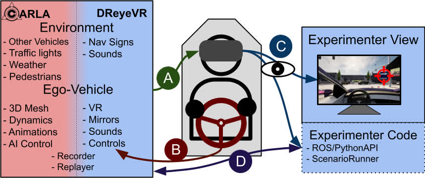
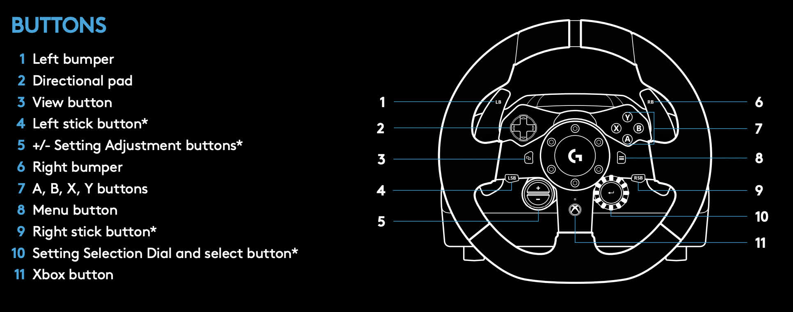

# Using `DReyeVR`

Now that you have DReyeVR up and running, this guide will highlight some useful features for researchers using DReyeVR:
- [Maneuvering the Ego-vehicle](Usage.md#maneuvering-the-ego-vehicle)
- [Using the PythonAPI](Usage.md#using-the-pythonapi)
- [Adding custom data to the ego-sensor](Usage.md#adding-custom-data-to-the-ego-sensor)
- [Recording/replaying a scenario](Usage.md#recordingreplaying-a-scenario)
- [Switching control from manual to AI (handoff)](Usage.md#control-handoff-to-ai)
- [Using our config file to modify DReyeVR params](Usage.md#using-our-custom-config-file)
- [Synchronized replay with frame capture](Usage.md#synchronized-replay-frame-capture)
- [Other guides](Usage.md#other-guides)



# Maneuvering the Ego-vehicle
These control schemes work both in VR and non-VR. With the main difference being that in VR you can move the camera pose and orientation with your head tracking, but in flat-screen-mode (non-VR) you'll need to use a mouse like in a first-person game. 
- Keyboard vehicle control scheme:
  - **Camera Gaze** - When in the 2D (flat/non-VR) view, turn the camera by clicking and dragging
  - **Throttle** - Is done by pressing and holding `W`
  - **Steering** - Is done with `A` to steer left and `D` to steer right
  - **Brake** - Is done by pressing and holding `S`
  - **Toggle Reverse** - Is done by pressing `LAlt`
  - **Turn Signals** - Are both done by pressing `Q` (left) or `E` (right)
  - **Possess Spectator** - Is done by pressing `1` (then use `WASDEQ+mouse` to fly around)
  - **Re-possess Vehicle** - Is done by pressing `2`
  - **Handoff to AI** - Is done by pressing `3` (then the vehicle's AI mode takes over if running)
  - **Camera Adjust** - Is done in X and Y with the arrow keys (up, down, left, right) and in Z with the pg-ip/pg-down buttons 
- Logitech control scheme:
  - **Throttle** - Is done by pushing down on the accelerator pedal
  - **Steering** - Is done by turning the steering wheel 
  - **Brake** - Is done by pushing down on the brake pedal
  - **Toggle Reverse** - Is done by pressing any of the `ABXY` (7 in the image) buttons 
  - **Turn Signals** - Are both done by the left (4) and right (6) bumpers 
  - **Camera Adjust** - Is done in X and Y with the 4 d-pad buttons (2) on the face of the wheel, and in Z with the +/- buttons (5)
-  Image source: [Logitech g923 manual](https://www.logitech.com/assets/65932/2/g923-racing-wheel-qsg.pdf)

Note that all the keyboard inputs are defined in [`DefaultInput.ini`](../Configs/DefaultInput.ini) where all DReyeVR-specific controls have been suffixed with "`_DReyeVR`". Feel free to change any of the controls if you'd like.

However, the logitech wheel inputs are hardcoded into the source since they are checked for on every tick (instead of through the UE4 keyboard events). To see the values and modify them, see [`EgoInputs.cpp`](../DReyeVR/EgoInputs.cpp)
  
# Using the PythonAPI
With the main Carla server running you should now be able to run all Carla provided `PythonAPI` scripts.
- Note that not all scripts in the original [`Carla 0.9.13` PythonAPI](https://github.com/carla-simulator/carla/tree/0.9.13/PythonAPI) repo have been tested. We created some new scripts in place of others, such as `schematic_mode.py` which inherits from `no_rendering_mode.py` but adds support for our ego-vehicle and eye tracker. 
- In some cases, we replace the old python scripts with newer ones, such as the [`no_rendering_mode.py`](https://github.com/carla-simulator/scenario_runner/blob/v0.9.13/no_rendering_mode.py) in `scenario-runner-v0.9.13` which is actually from release 0.9.5. 

### Visualize in schematic mode
```bash
cd $CARLA_ROOT/PythonAPI/examples/ # go to carla/

./schematic_mode.py 
```

### Logging DReyeVR sensor data to PythonAPI
```bash
cd $CARLA_ROOT/PythonAPI/examples/

# see all the DReyeVR sensor data
./DReyeVR_logging.py # prints directly in stdout

# or if you have a running roscore (with rospy)
./DReyeVR_logging.py --rh '192.168.X.Y' --rp 11311 # pass in roscore host & ports
```
- We support ROS data streaming using `rospy` on an Ubuntu 20.04 LTS host. If you are interested in using a VM for this purpose, we'd recommend checking out [`VirtualMachine/README.md`](../Tools/VirtualMachine/README.md) as the setup is fairly involved.

### Start the DReyeVR AI controller
```bash
cd $CARLA_ROOT/PythonAPI/examples/

# DReyeVR AI controller requires this script to be running
./DReyeVR_AI.py -n 0 # won't control vehicle unless control is handoff to AI (press 3)
```

### Start recording/replaying
```bash
cd $CARLA_ROOT/PythonAPI/examples/

# start a recording with no other agents
./start_recording.py -n 0
...
^C

# replay the file just recorded
./start_replaying.py

# dump the replay file in a human-readable manner to replay.txt
./show_recorder_file_info.py -a > replay.txt
```

### Run a ScenarioRunner instance and record
```bash
cd $SCENARIO_RUNNER_ROOT # go to scenario-runner/

./run_experiment.py --title name_of_experiment --route srunner/data/routes_debug.xml srunner/data/all_towns_traffic_scenarios1_3_4.json 0 --output --reloadWorld
...
^C
```

## Using our new DReyeVR PythonAPI
For your own custom scripts, we recommend taking a look at the [`DReyeVR_utils.py`](../PythonAPI/DReyeVR_utils.py) file, specifically the two functions:
- `find_ego_vehicle` which takes in the `carla.libcarla.World` instance and returns the DReyeVR ego-vehicle (`carla.libcarla.Vehicle`) present in the world (or `None` if there is none)
- `find_ego_sensor` which takes in the `carla.libcarla.World` instance and returns the DReyeVR eye tracker (`carla.libcarla.Sensor`) present in the world (or `None` if there is none)

Then, in your script, you can follow the technique we used in `schematic_mode.py` such as:
```python
  world = self.client.get_world()

  # find ego vehicle
  self.hero_actor = find_ego_vehicle(world)
  self.hero_transform = self.hero_actor.get_transform()

  # find ego sensor
  # DReyeVRSensor implicitly calls find_ego_sensor, then wraps it with a custom class
  self.sensor = DReyeVRSensor(world) 
  self.sensor.ego_sensor.listen(self.sensor.update)  # subscribe to readout
```
Now you can proceed to use `self.sensor.ego_sensor` as a standard [`carla.libcarla.Sensor`](https://github.com/carla-simulator/carla/blob/master/Docs/python_api.md#carlasensor) object and `self.hero_actor` as a standard [`carla.libcarla.Vehicle`](https://github.com/carla-simulator/carla/blob/master/Docs/python_api.md#carlavehicle) object. 

# Adding custom data to the ego-sensor
- The first file you'll want to look at is interested in is `Unreal/CarlaUE4/Plugins/Carla/Source/Carla/Sensor/`[`DReyeVRData.h`](../Carla/Sensor/DReyeVRData.h) which contains the data structures that compose the contents of the ego sensor. Here you'll define the variable and its serialization methods (read/write/print). 
  ```c++
  /// DReyeVRData.h
  class AggregateData // all DReyeVR sensor data is held here
  {
    public:
      ... // existing code
      float GetNewVariable() const;
      ////////////////////:SETTERS://////////////////////

      ...
      void SetNewVariable(const float NewVariableIn);

      ////////////////////:SERIALIZATION://////////////////////
      void Read(std::ifstream &InFile);

      void Write(std::ofstream &OutFile) const;

      FString ToString() const; // this printing is used when showing recorder info

    private:
    ... // existing code
    float NewVariable; // <-- Your new variable
  };
  ```

  Then, you'll want to write the implementation in `Unreal/CarlaUE4/Plugins/Carla/Source/Carla/Sensor/`[`DReyeVRData.inl`](../Carla/Sensor/DReyeVRData.inl) as inline funcitons. 
  ```c++
  /// DReyeVRData.inl
  ...
  inline float AggregateData::GetNewVariable() const
  {
      return NewVariable;
  }

  ...
  inline void AggregateData::SetNewVariable(const float NewVariableIn)
  {
    NewVariable = NewVariableIn;
  }

  inline void AggregateData::Read(std::ifstream &InFile)
  {
      /// CAUTION: make sure the order of writes/reads is the same
      ... // existing code
      ReadValue<float>(InFile, NewVariable);
  }

  inline void AggregateData::Write(std::ofstream &OutFile) const
  {
      /// CAUTION: make sure the order of writes/reads is the same
      ... // existing code
      WriteValue<int64_t>(OutFile, GetNewVariable());
  }

  inline FString AggregateData::ToString() const // this printing is used when showing recorder info
  {
      FString print;
      ... // existing code
      print += FString::Printf(TEXT("[DReyeVR]NewVariable:%.3f,\n"), GetNewVariable());
      return print;
  }
  ...
  ```

  **NOTE** It is nice syntactically to contain bunches of variables in structures so they can be better organized, and this is especially true with our AggregateData instance, where almost all our existing data fields are packed into other structs. The basic template is the same as described above. 


  **NOTE** The above is an example of adding a new variable directly to `DReyeVR::AggregateData`. This is often not recommended since it'd probably be cleaner to use a simple class abstraction like most of our variables are in. But thats up to you!

  With this step complete, you are free to read/write to this variable by getting the single global (`static`) instance of the `DReyeVR::AggregateData` class using the `GetData()` function of the EgoSensor as follows:
  ```c++
    // In some other file, for example EgoVehicle.cpp:
    float NewVariable = EgoSensor->GetData()->GetNewVariable();
    ... // your code
    EgoSensor->GetData()->SetNewVariable(NewVariable + 5.f); // update the new variable
  ```
  - To clarify the structure of the inheritance at play here (Older generation to youngest):
    1. [`AActor`](https://docs.unrealengine.com/4.27/en-US/API/Runtime/Engine/GameFramework/AActor/): Low-level unreal class for any object that can be spawned into the world
    2. [`ASensor`](https://github.com/carla-simulator/carla/blob/0.9.13/Unreal/CarlaUE4/Plugins/Carla/Source/Carla/Sensor/Sensor.h): Carla actor that templates the structure for Sensors acting in the Carla world
    3. [`ADReyeVRSensor`](../Carla/Sensor/DReyeVRSensor.h): Our sensor instance that contains logic for all Carla related tasks
        - Streaming to the PythonAPI
        - Receiving data from replayer to reenact
        - Contains instance of `DReyeVR::AggregateData` containing ALL the data
    4. [`AEgoSensor`](../DReyeVR/EgoSensor.h): Our primary actor containing all DReyeVR related logic for custom data variables/functions
        - Eye tracking logic (SRanipal), ego vehicle tracking, etc. 
  
- [OPTIONAL]Streaming data to a PythonAPI client:
  - In order to see the new data from a PythonAPI client, you'll need to duplicate the code to the LibCarla serializer. This requires looking at `LibCarla/Sensor/s11n/`[`DReyeVRSerializer.h`](../LibCarla/Sensor/s11n/DReyeVRSerializer.h) and following the same template as all the other variables:
    ```c++
    class DReyeVRSerializer
    {
      public:
        struct Data
        {
          ... // existing code
          float NewVariable;

          MSGPACK_DEFINE_ARRAY(
            ... // existing code
            NewVariable, // <-- New variable
          )
        };
    };
    ///NOTE: you'll also need to interface with this updated struct:
    ```
  - Then, to actually interface with the DReyeVR sensor, you'll need to modify the call to the LibCarla stream to include your `NewVariable`.
    ```c++
    // in Carla/Sensor/DReyeVRSensor.cpp
    void ADReyeVRSensor::PostPhysTick(UWorld *W, ELevelTick TickType, float DeltaSeconds)
    {
      ... // existing code
      Stream.Send(*this,
                  carla::sensor::s11n::DReyeVRSerializer::Data{
                      ... // existing code
                      Data->GetNewVariable(), // <-- New variable
                  });
    } 
    ```
  - And finally, to actually get the data from a PythonAPI call, you'll need to modify the list of available attributes to the DReyeVR sensor object as follows:
    ```c++
    // in LibCarla/source/carla/sensor/data/DReyeVREvent.h
    class DReyeVREvent : public SensorData
    {
      ...

      public:
        ... // existing code
        float GetNewVariable() const // <-- new code
        {
            return InternalData.NewVariable;
        }

      private:
        carla::sensor::s11n::DReyeVRSerializer::Data InternalData;
    };
    ```
    Then finally here you'll define what function to call (the variable getter) to get that data from a PythonAPI client. 
    ```c++
    // in PythonAPI/carla/source/libcarla/SensorData.cpp
    class_<csd::DReyeVREvent, bases<cs::SensorData>, boost::noncopyable, boost::shared_ptr<csd::DReyeVREvent>>("DReyeVREvent", no_init)
        ... // existing code
        .add_property("new_variable", CALL_RETURNING_COPY(csd::DReyeVREvent, GetNewVariable))
        .def(self_ns::str(self_ns::self))
    ;
    ```

# Recording/Replaying a scenario
## Motivations
It is often useful to record a scenario of an experiment in order to reenact it in post and perform further analysis. We had to slightly augment the recorder and replayer to respect our ego-vehicle being persistent in the world, but all other functionality is maintained. We additionally reenact the ego-sensor data (including HMD pose and orientation) so an experimenter could see what the participant was looking at on every tick. For the full explanation of the Carla recorder see their [documentation](https://carla.readthedocs.io/en/0.9.13/adv_recorder/). 

## Recording
The easiest way to start recording is with the handy `PythonAPI` scripts. 
```bash
cd $CARLA_ROOT/PythonAPI/examples/
# this starts a recording session with 10 autonomous vehicles
./start_recording.py -n 10 # change -n param to change number of vehicles (default 10)
...
^C # stop recording with a SIGINT (interrupt)
```
- Note that the recording halts if a new world is loaded, so if you want to change the world make sure to restart the recording after the world has loaded.
- The recording saves the default file as a `test1.log` file in the default saved directory of your project:
	- If recording from editor: `carla/Unreal/CarlaUE4/Saved/test1.log`
	- If recording from package: `${PACKAGE}/Unreal/Saved/test1.log` <!-- TODO: CHECK THIS -->
- The recording should have relatively minimal impact on the performance of the simulator, but this likely varies by machine. The experience should be essentially the same. 
- Note that the recorder saves everything in binary, so it the raw `test1.log` file is not human-readable. It is often nice to read it however, in that case use:
	- ```bash
		# saves output (stdout) to recorder.txt
		./show_recorder_file_info.py -a -f /PATH/TO/RECORDER-FILE > recorder.txt 
		```
## Replaying
Begin a replay session through the PythonAPI as follows:
```bash
# note this does not rely on being in VR mode or not. 
./start_replaying.py # this starts the replaying session
```
- Note that in the replaying mode, all user inputs will be ignored in favour of the replay inputs. However, you may still use the following level controls:
  1. **Toggle Play/Pause** - Is done by pressing `SpaceBar`
  2. **Advance** - Is done by holding `Alt` and pressing `Left` arrow (backwards) or `Right` arrow (forwards)
  3. **Change Playback Speed** - Is done by holding `Alt` and pressing `Up` arrow (increase) or `Down` arrow (decrease)
  4. **Restart** - Is done by holding `Alt` and pressing `BackSpace`
  6. **Possess Spectator** - Is done by pressing `1` (then use `WASDEQ+mouse` to fly around)
  7. **Re-possess Vehicle** - Is done by pressing `2`

To get accurate screenshots for every frame of the recording, see below with [synchronized replay frame capture](#synchronized-replay-frame-capture)

## Scenarios
It is usually ideal to have curated experiments in the form of scenarios parsed through [ScenarioRunner](https://carla-scenariorunner.readthedocs.io/en/latest/).

For this purpose, we created a handy script that should be robust to some of the quirks of the existing implementation. This script ([`run_experiment.py`](../ScenarioRunner/run_experiment.py)) will automatically start recording for you AFTER the new map has been loaded, with a unique filename, all on a single client instance, so that you don't need to worry about a faulty recording or overwriting existing files. 

With `scenario_runner` v0.9.13, you should have already set these environment variables:
```bash
# on bash (Linux)
export CARLA_ROOT=/PATH/TO/carla/
export SCENARIO_RUNNER_ROOT=/PATH/TO/scenario_runner/
export PYTHONPATH=$PYTHONPATH:${CARLA_ROOT}/PythonAPI/carla/dist/carla-0.9.13-py3.7-linux-x86_64.egg                                           
export PYTHONPATH=$PYTHONPATH:${CARLA_ROOT}/PythonAPI/carla/agents
export PYTHONPATH=$PYTHONPATH:${CARLA_ROOT}/PythonAPI/carla
export PYTHONPATH=$PYTHONPATH:${CARLA_ROOT}/PythonAPI

# on Windows x64 Visual C++ Toolset
set CARLA_ROOT=C:PATH\TO\carla\
set SCENARIO_RUNNER_ROOT=C:PATH\TO\scenario_runner\
set PYTHONPATH=%PYTHONPATH%;%CARLA_ROOT%\PythonAPI\carla\dist\carla-0.9.13-py3.7-win-amd64.egg
set PYTHONPATH=%PYTHONPATH%;%CARLA_ROOT%\PythonAPI\carla\agents
set PYTHONPATH=%PYTHONPATH%;%CARLA_ROOT%\PythonAPI\carla
set PYTHONPATH=%PYTHONPATH%;%CARLA_ROOT%\PythonAPI
```
Then to run our demo examples, use this command:
```bash
# on bash (Linux)
cd $SCENARIO_RUNNER_ROOT # go to scenario-runner
./run_experiment.py --title "dreyevr_experiment" --route $SCENARIO_RUNNER_ROOT/srunner/data/routes_custom.xml $SCENARIO_RUNNER_ROOT/srunner/data/town05_scenarios.json 0

# on Windows x64 Visual C++ Toolset
cd %SCENARIO_RUNNER_ROOT% # go to scenario-runner
python run_experiment.py --title "dreyevr_experiment" --route %SCENARIO_RUNNER_ROOT%\srunner\data\routes_custom.xml %SCENARIO_RUNNER_ROOT%\srunner\data\town05_scenarios.json 0
```
Note that you can rename the experiment to anything with `--title "your_experiment"`, and the resulting recording file will include this title in its filename. 

# Control handoff to AI
Sometimes it is useful to have an AI takeover of the ego-vehicle during an experiment for research purposes. This becomes easy to do in our simulator with the help of Carla's existing [TrafficManager-based autopilot](https://carla.readthedocs.io/en/0.9.13/adv_traffic_manager/) which can pilot our ego-vehicle just like any other carla Vehicle. 

However, in order to start the autopilot, we currently only support using the PythonAPI for this task, so we created `DReyeVR_AI.py` which will do the job:
```bash
cd $CARLA_ROOT/PythonAPI/examples # go to carla PythonAPI
./DReyeVR_AI.py -n 0 # spawn no other vehicles, enable autopilot on EgoVehicle
```

Internally, the AI system is using the Carla vehicle autopilot system, so this can be enabled in your custom PythonAPI scripts without the use of `DReyeVR_AI.py` by performing:
```python
from DReyeVR_utils import find_ego_vehicle
...

world = client.get_world()
traffic_manager = client.get_trafficmanager(args.tm_port)
...

DReyeVR_vehicle = find_ego_vehicle(world)
if DReyeVR_vehicle is not None:
    DReyeVR_vehicle.set_autopilot(True, traffic_manager.get_port())
    print("Successfully set autopilot on ego vehicle")
```

Currently we only support manual handoff by pressing `3` on the keyboard. This gives input priority to the Carla [WheeledVehicleAIController](https://github.com/carla-simulator/carla/blob/0.9.13/Unreal/CarlaUE4/Plugins/Carla/Source/Carla/Vehicle/WheeledVehicleAIController.cpp) which will follow some route defined by Carla's TrafficManager.

In order to re-possess the vehicle (handoff control back to the player), simply press `1`. Keyboard inputs are automatically higher priority than the autopilot.

[OPTIONAL]Using this same approach, there is a third option where you can press `2` to possess a "spectator" that can no-clip and fly around the map using `WASDEQ+mouse` controls. 

You can press any of the control options: `1`(human driver), `2`(spectator), `3`(AI driver) at any time.
Summary: 

| Press `1` | Press `2` | Press `3` |
| --- | --- | --- |
| Human driving | Spectator mode | AI driving |


# Using our custom config file
Throughout development, we found that modifying even small things in DReyeVR have a LONG cycle time for recompilation/re-linking/re-cooking/etc. so we wanted an approach that could greatly ease this burden while still providing flexibility.

This is why we developed the [`DReyeVRConfig.ini`](../Configs/DReyeVRConfig.ini) param file and associated helper functions in [`DReyeVRUtils.h`](../DReyeVR/DReyeVRUtils.h) so we could simply read the file at runtime and modify small params from the internal code without recompilation. 

The procedure to use our params API is simple:
```c++
// in, any class, say EgoVehicle.h
#include "DReyeVRUtils.h" // make sure to include our local header file!

class CARLAUE4_API AEgoVehicle : public ACarlaWheeledVehicle
{
  ... // existing code

  float MyFavouriteNumber; // <--Your new param
}
```
Then, in that class' constructor (typically) or BeginPlay, or technically anywhere in the source, since this occurs at runtime (but you usually don't want to use uninitialized data members)

```c++
// ex: EgoVehicle.cpp:
AEgoVehicle::AEgoVehicle(const FObjectInitializer &ObjectInitializer) : Super(ObjectInitializer)
{
    // don't modify, just note this is called in the constructor
    ReadConfigVariables(); 

    ... // existing code
}

void AEgoVehicle::ReadConfigVariables()
{
    ... // existing code

    // ReadConfigValue("YourSectionHeader", "YourVariableName", Variable);
    ReadConfigValue("MyFavourites", "Number", MyFavouriteNumber);
}
```

Then, in the config file, you can simply add this variable in the section and variable described from `ReadConfigValue` as follows
```ini
[MyFavourites]
Number=867.5309; Note you can also write comments!
```

And, just like the other variables in the file, you can bunch and organize them together under the same section header.

# Synchronized replay frame capture
## Motivations
After performing (and recording) an [experiment](../ScenarioRunner/run_experiment.py), we are provided with a log of everything that happened in the simulator that we can use for live reenactment and post-hoc analysis. It is often the case that after some postprocessing on the data, we might be interested in overlaying something on the simulator view to match what a participant was seeing/doing and what the world looked like. Unfortunately, it is difficult to get the exact image frame corresponding to an exact recording event using an asynchronous screen recorder such as OBS, therefore we baked in this functionality within the engine itself, so it can directly go to any recorded event and take a high quality screenshot. The end result is the exact frame-by-frame views corresponding to the recorded world conditions without interpolation. 

To enable this feature, toggle the `RunSyncReplay` flag in [`DReyeVRConfig.ini`](../Configs/DReyeVRConfig.ini) under the `[Replayer]` section. This will allow for frame-by-frame reenactment (otherwise the replay will respect wall-clock-time and introduce interpolation between frames). In order to additionally perform frame capture during this replay, make sure to have the `RecordFrames` flag enabled as well. There are several other frame capture options below such as resolution and gamma parameters. 

The resulting frame capture images (`.png` or `.jpg` depending on the `FileFormatJPG` flag) will be found in `Unreal/CarlaUE4/{FrameDir}/{DateTimeNow}/{FrameName}*` where `{FrameDir}` and `{FrameName}` are both determined in the [`DReyeVRConfig.ini`](../Configs/DReyeVRConfig.ini). The `{DateTimeNow}` string is uniquely based on your machine's local current time so you can run multiple recordings without overwriting old files. 


With these flags enabled, any time you initiate a replay such as:
```bash
# in PythonAPI/examples
./start_replaying.py -f /PATH/TO/RECORDING/FILE # unix

python start_replaying.py -f /PATH/TO/RECORDING/FILE # windows
```


# Other guides
We have written other guides as well that serve more particular needs:
- See [`F.A.Q. wiki`](https://github.com/HARPLab/DReyeVR/wiki/Frequently-Asked-Questions) for our Frequently Asked Questions wiki page.
- See [`Docs/SetupVR.md`](SetupVR.md) to learn how to quickly and minimally set up VR with Carla
- See [`Docs/Sounds.md`](Sounds.md) to see how we added custom sounds and how you can add your own custom sounds
- See [`Docs/Signs.md`](Signs.md) to add custom in-world directional signs and dynamically spawn them into the world at runtime
- See [`Docs/CustomActor.md`](CustomActor.md) to use our CustomActor classes to use fully-recordable 3D dynamic elements in your scene
- See [`Docs/Model.md`](Model.md) to see how we added a responsive steering wheel to the vehicle mesh
- See [`Docs/LODs.md`](LODs.md) to learn how we tune the Level-Of-Detail modes for vehicles for a more enjoyable VR experience


# Quirks:
- On Windows you're going to want to use the `Windows x64 Visual C++ Toolset` and call all the python files with `python SCRIPT.py` rather than just `./SCRIPT.py`
    - Additionally, environment variables are accessed `%LIKE_THIS%` instead of `$LIKE_THIS`.
    - And remember that file paths use a backwards slash to `LOCATE\FILES\THIS\WAY\` instead of `THE/NORMAL/WAY/`
- There is a bug (we are not sure why, occurs in base carla too), where `Town06/07/10HD` are not present in the `package`d release. Some documentation [here](https://carla.readthedocs.io/en/0.9.13/start_quickstart/#import-additional-assets). 