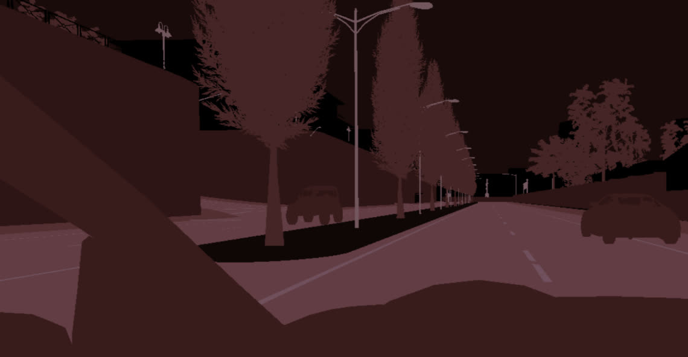
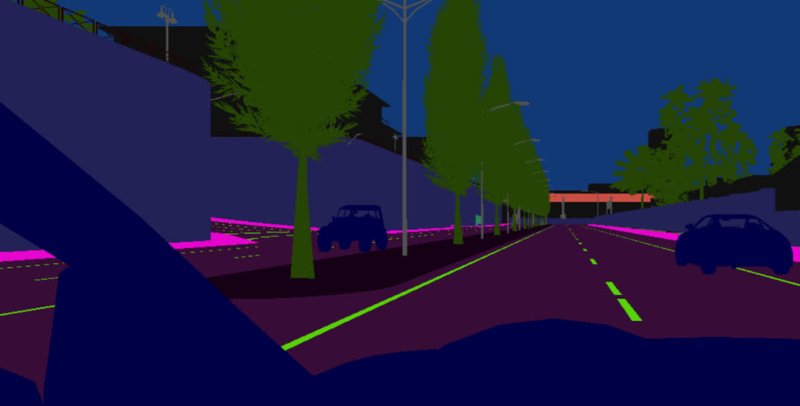

# UE4 Scene Capture Shaders

For fancy sensors such as the [Semantic Segmentation camera](https://carla.readthedocs.io/en/0.9.13/ref_sensors/#semantic-segmentation-camera), Carla uses [post-processing materials](https://github.com/carla-simulator/carla/tree/master/Unreal/CarlaUE4/Plugins/Carla/Content/PostProcessingMaterials) to act as shaders and produce high-quality results with minimal cost to performance. 

An excellent tutorial by UE4 on the subject can be found [here (youtube)](https://www.youtube.com/watch?v=PiQ_JLJKi0M)

Without getting too much into the details, the post-processing effect materials held here serve as shaders that can take information such as custom stencil/depth buffers and produce pixel-wise computations very efficiently.

| Description | Demo |
| --- | --- |
| For example, Carla's `GTMaterial.uasset` shader is used to encode custom stencil information into the **red** channel of the output images, producing an image such as this (colours exaggerated for viewing). Then in the PythonAPI client, the LibCarla definitions for [City Palettes](https://github.com/carla-simulator/carla/blob/master/LibCarla/source/carla/image/CityScapesPalette.h) is applied to convert the image to user-desired colours by index. |  |
| By contrast, our `DReyeVR_SemanticSegmentation` shader builds on the fundamentals of the Carla GTMaterial but directly indexes the array of colours in the shader itself, so you can effortlessly obtain semantic colour information straight into the first-person-camera. |  |

We are interested in including the various shader outputs in our replay functionality. 

To demo the shaders we include in DReyeVR in real time, press `.` (period) for the next and `,` (comma) for the previous shaders. 